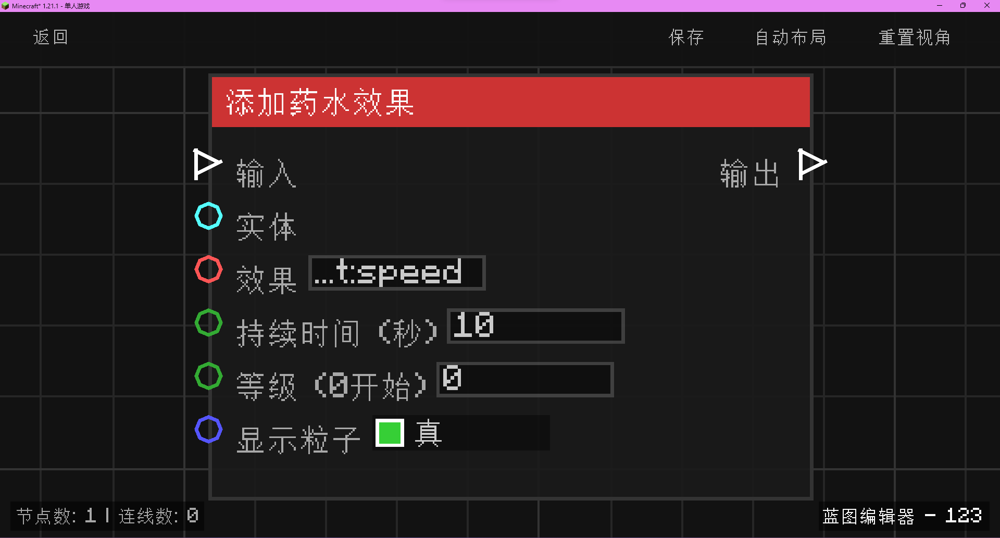

# 添加药水效果 (Add Potion Effect)

**添加药水效果** 节点允许为指定的生物施加各种药水效果（如速度、力量、中毒等）。

## 节点概览
- **分类**: 动作 > 实体动作
- **内部ID**：`mgmc:add_potion_effect`
- 

## 端口定义

### 输入 (Inputs)
| 端口名称 | 类型 | 说明 |
| :--- | :--- | :--- |
| **输入** (Exec) | 执行流 | 触发该节点的运行。 |
| **目标实体** (Entity) | 实体 (Entity) | 要施加效果的生物（必须是生物，如玩家或动物）。如果未连接，则默认尝试施加给触发蓝图的生物。 |
| **效果名称** (Effect) | 字符串 (String) | 药水效果的 ID（如 `minecraft:speed`, `minecraft:strength`）。默认为 `minecraft:speed`。 |
| **持续时间 (秒)** (Duration) | 整数 (Int) | 效果持续的时间（秒）。默认为 `10`。 |
| **效果等级** (Amplifier) | 整数 (Int) | 效果的等级（从 0 开始计数，0 表示 I 级，1 表示 II 级）。默认为 `0`。 |
| **显示粒子** (Show Particles) | 布尔值 (Boolean) | 是否在生物周围显示药水粒子特效。默认为 `true`。 |

### 输出 (Outputs)
| 端口名称 | 类型 | 说明 |
| :--- | :--- | :--- |
| **输出** (Exec) | 执行流 | 节点逻辑执行完毕后，触发后续节点的运行。 |

## 行为说明
1. **生物限制**：该节点仅对 `LivingEntity`（生物）生效。
2. **实体回退机制**：如果“目标实体”端口没有输入，节点会尝试获取蓝图的触发者（Trigger Entity）进行操作。
3. **时间转换**：输入的秒数（整数）会被转换为游戏刻（Ticks，1秒 = 20刻）。
4. **有效性检查**：效果名称 must be 有效的 Minecraft 药水效果 ID。如果 ID 错误，节点将不会产生任何效果。
