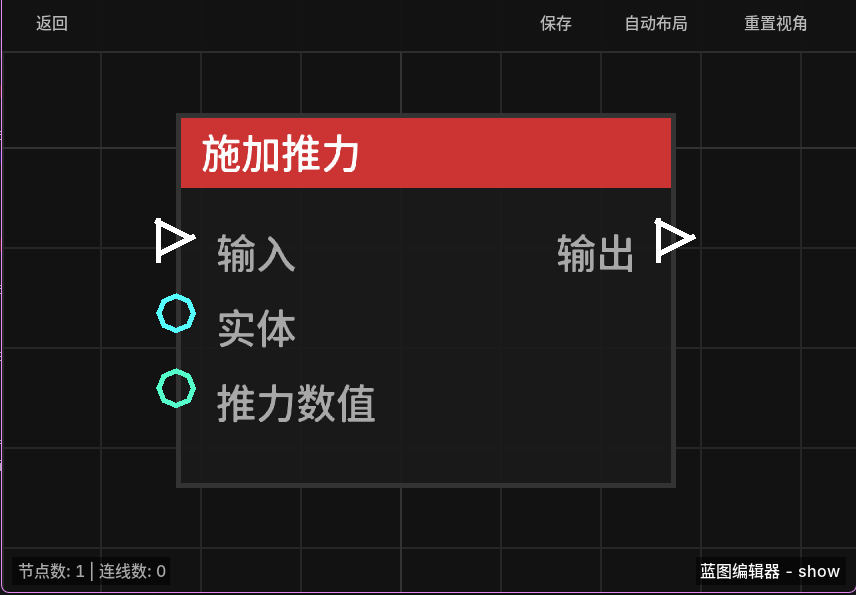

# 施加推力 (Apply Impulse)

**施加推力** 节点允许为指定的实体设置一个瞬时的速度矢量，使其向特定方向“弹射”或移动。这在制作弹射器、击退效果或自定义移动逻辑时非常有用。

## 节点概览
- **分类**: 动作 > 实体动作
- **内部ID**：`mgmc:apply_impulse`
- 

## 端口定义

### 输入 (Inputs)
| 端口名称 | 类型 | 说明 |
| :--- | :--- | :--- |
| **输入** (Exec) | 执行流 | 触发该节点的运行。 |
| **目标实体** (Entity) | 实体 (Entity) | 要施加推力的实体。如果未连接，则默认尝试作用于触发蓝图的实体。 |
| **推力数值** (Impulse) | 坐标 (XYZ) | 推力的方向和强度。X、Y、Z 分别代表在三个轴向上的速度分量。 |

### 输出 (Outputs)
| 端口名称 | 类型 | 说明 |
| :--- | :--- | :--- |
| **输出** (Exec) | 执行流 | 节点逻辑执行完毕后，触发后续节点的运行。 |

## 行为说明
1. **瞬时速度**：该节点直接设置实体的 `DeltaMovement`（即运动向量）。它会覆盖实体当前的运动状态。
2. **客户端同步**：节点会自动设置实体的 `hurtMarked` 属性为 `true`，以确保服务器上的速度变化能立即同步到玩家客户端，避免出现位置“回弹”现象。
3. **坐标说明**：
   - **Y 轴正值**：向上弹出（如 0.5 到 1.0 之间的值可以模拟跳跃或轻微弹起）。
   - **水平面 (X, Z)**：控制实体的水平移动方向。
4. **实体回退**：如果“目标实体”未提供，将作用于蓝图的触发实体（Trigger Entity）。
