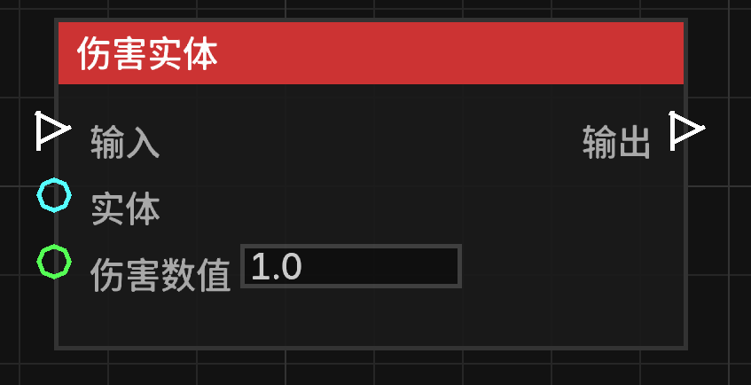

# 伤害实体 (Damage Entity)

**伤害实体** 节点允许对指定的实体造成特定数值的伤害。

## 节点概览
- **分类**: 动作 > 实体动作
- **内部ID**：`mgmc:damage_entity`
- 

## 端口定义

### 输入 (Inputs)
| 端口名称 | 类型 | 说明 |
| :--- | :--- | :--- |
| **输入** (Exec) | 执行流 | 触发该节点的运行。 |
| **目标实体** (Entity) | 实体 (Entity) | 要受到伤害的实体。如果未连接，则默认尝试伤害触发蓝图的实体。 |
| **伤害数值** (Damage Amount) | 浮点数 (Float) | 要造成的伤害数值。默认为 `1.0`（即半颗心）。 |

### 输出 (Outputs)
| 端口名称 | 类型 | 说明 |
| :--- | :--- | :--- |
| **输出** (Exec) | 执行流 | 节点逻辑执行完毕后，触发后续节点的运行。 |

## 行为说明
1. **实体回退机制**：如果“目标实体”端口没有输入，节点会尝试获取蓝图的触发者（Trigger Entity）进行伤害操作。
2. **伤害类型**：该节点造成的伤害类型为“通用伤害”（Generic Damage）
