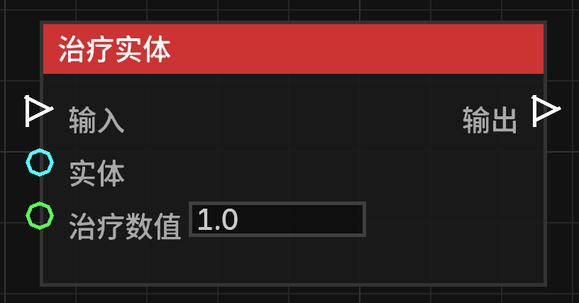

# 治疗实体 (Heal Entity)

**治疗实体** 节点允许恢复指定实体的生命值。

## 节点概览
- **分类**: 动作 > 实体动作
- **内部ID**：`mgmc:heal_entity`
- 

## 端口定义

### 输入 (Inputs)
| 端口名称 | 类型 | 说明 |
| :--- | :--- | :--- |
| **输入** (Exec) | 执行流 | 触发该节点的运行。 |
| **目标实体** (Entity) | 实体 (Entity) | 要接受治疗的生物（必须是生物，如玩家或动物）。如果未连接，则默认尝试治疗触发蓝图的生物。 |
| **治疗数值** (Heal Amount) | 浮点数 (Float) | 要恢复的生命值数值。默认为 `1.0`（即半颗心）。 |

### 输出 (Outputs)
| 端口名称 | 类型 | 说明 |
| :--- | :--- | :--- |
| **输出** (Exec) | 执行流 | 节点逻辑执行完毕后，触发后续节点的运行。 |

## 行为说明
1. **生物限制**：该节点仅对 `LivingEntity`（生物）生效。非生物实体（如掉落物、箭矢）无法接受治疗。
2. **实体回退机制**：如果“目标实体”端口没有输入，节点会尝试获取蓝图的触发者（Trigger Entity）进行治疗。
