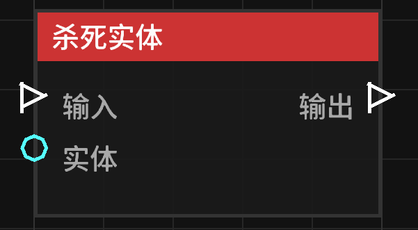

# 杀死实体 (Kill Entity)

**杀死实体** 节点允许立即移除指定的实体。

## 节点概览
- **分类**: 动作 > 实体动作
- **内部ID**：`mgmc:kill_entity`
- 

## 端口定义

### 输入 (Inputs)
| 端口名称 | 类型 | 说明 |
| :--- | :--- | :--- |
| **输入** (Exec) | 执行流 | 触发该节点的运行。 |
| **目标实体** (Entity) | 实体 (Entity) | 要杀死的实体。如果未连接，则默认尝试杀死触发蓝图的实体。 |

### 输出 (Outputs)
| 端口名称 | 类型 | 说明 |
| :--- | :--- | :--- |
| **输出** (Exec) | 执行流 | 节点逻辑执行完毕后，触发后续节点的运行。 |

## 行为说明
1. **实体回退机制**：如果“目标实体”端口没有输入，节点会尝试获取蓝图的触发者（Trigger Entity）进行杀死操作。
2. **执行方式**：
   - 在服务端执行时，使用标准的 `kill` 逻辑，会触发实体的死亡事件（如掉落经验和物品）。
   - 如果在非服务端环境下（如某些特殊同步场景），则使用 `discard` 直接移除实体。
3. **权限说明**：该节点由蓝图引擎直接调用，无视常规的伤害保护。
