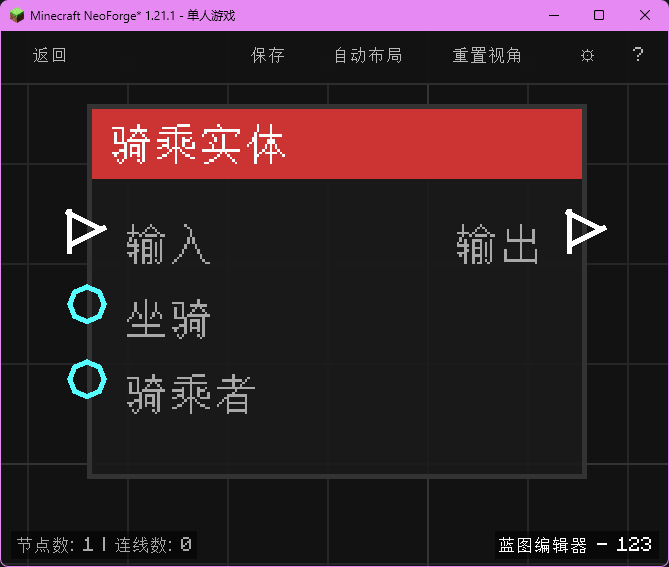

# 骑乘实体 (Ride Entity)

让一个实体骑乘在另一个实体上。

## 节点概览
- **分类**: 动作 > 实体
- **内部ID**：`mgmc:ride_entity`
- 

## 端口定义

### 输入 (Inputs)
| 端口名称 | 类型 | 说明 |
| :--- | :--- | :--- |
| **执行流** (In) | 执行流 (Exec) | 触发节点执行。 |
| **坐骑** (Mount) | 实体 (Entity) | 被骑乘的实体（下）。 |
| **骑乘者** (Rider) | 实体 (Entity) | 骑上去的实体（上）。 |

### 输出 (Outputs)
| 端口名称 | 类型 | 说明 |
| :--- | :--- | :--- |
| **执行流** (Out) | 执行流 (Exec) | 操作完成后继续执行。 |

## 行为说明
1. **主要行为**：建立骑乘关系。
2. **特殊情况**：如果实体已经死亡或不存在，操作无效。
