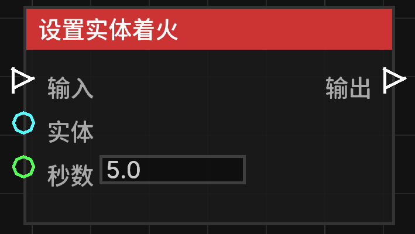

# 设置实体着火 (Set Entity on Fire)

**设置实体着火** 节点允许让指定的实体进入着火状态，并持续一定的时间。

## 节点概览
- **分类**: 动作 > 实体动作
- **内部ID**：`mgmc:set_entity_on_fire`
- 

## 端口定义

### 输入 (Inputs)
| 端口名称 | 类型 | 说明 |
| :--- | :--- | :--- |
| **输入** (Exec) | 执行流 | 触发该节点的运行。 |
| **目标实体** (Entity) | 实体 (Entity) | 要着火的实体。如果未连接，则默认尝试让触发蓝图的实体着火。 |
| **持续秒数** (Seconds) | 浮点数 (Float) | 着火持续的时间（秒）。默认为 `5.0`。 |

### 输出 (Outputs)
| 端口名称 | 类型 | 说明 |
| :--- | :--- | :--- |
| **输出** (Exec) | 执行流 | 节点逻辑执行完毕后，触发后续节点的运行。 |

## 行为说明
1. **实体回退机制**：如果“目标实体”端口没有输入，节点会尝试获取蓝图的触发者（Trigger Entity）进行操作。
2. **时间转换**：输入的秒数会被转换为游戏刻（Ticks，1秒 = 20刻）。
3. **着火逻辑**：该节点直接设置实体的剩余着火时间。如果实体已经在火中，这会覆盖或延长其着火时间。
4. **数值有效性**：持续秒数必须大于 0 才会生效。
