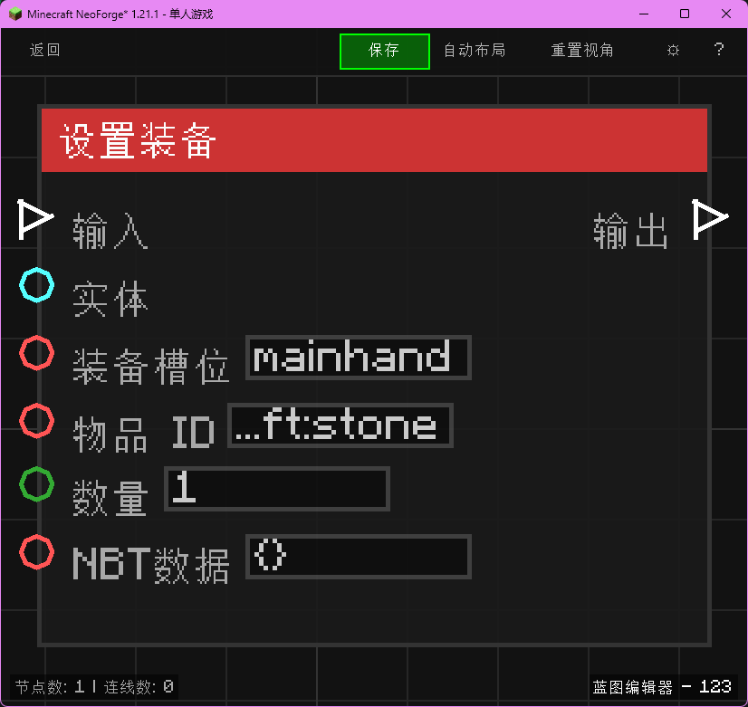

# 设置装备 (Set Equipment)

设置实体的装备或手持物品。

## 节点概览
- **分类**: 动作 > 实体
- **内部ID**：`mgmc:set_equipment`
- 

## 端口定义

### 输入 (Inputs)
| 端口名称 | 类型 | 说明 |
| :--- | :--- | :--- |
| **执行流** (In) | 执行流 (Exec) | 触发节点执行。 |
| **实体** (Entity) | 实体 (Entity) | 目标实体。 |
| **装备槽位** (Slot) | 字符串 (String) | 槽位名称：`mainhand`, `offhand`, `feet`, `legs`, `chest`, `head`。 |
| **物品 ID** (Item ID) | 字符串 (String) | 要设置的物品 ID。 |
| **数量** (Count) | 整数 (Integer) | 物品数量。 |
| **NBT数据** (NBT) | 字符串 (String) | 物品 NBT 数据。 |

### 输出 (Outputs)
| 端口名称 | 类型 | 说明 |
| :--- | :--- | :--- |
| **执行流** (Out) | 执行流 (Exec) | 设置完成后继续执行。 |

## 行为说明
1. **主要行为**：修改实体的装备槽内容。
2. **注意事项**：会覆盖该槽位原有的物品。
