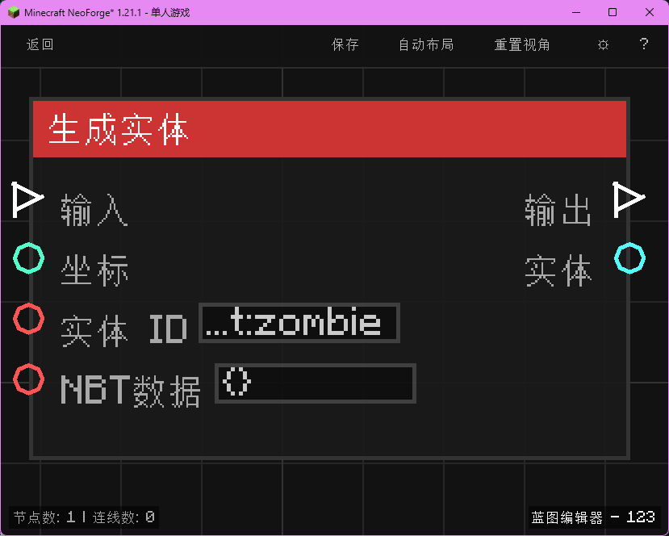

# 生成实体 (Spawn Entity)

在指定坐标生成一个新的实体。

## 节点概览
- **分类**: 动作 > 实体
- **内部ID**：`mgmc:spawn_entity`
- 

## 端口定义

### 输入 (Inputs)
| 端口名称 | 类型 | 说明 |
| :--- | :--- | :--- |
| **执行流** (In) | 执行流 (Exec) | 触发节点执行。 |
| **坐标** (XYZ) | 坐标 (XYZ) | 生成实体的位置。 |
| **实体 ID** (Entity ID) | 字符串 (String) | 实体的注册 ID（如 `minecraft:zombie`）。 |
| **NBT数据** (NBT) | 字符串 (String) | 初始 NBT 数据（JSON 格式）。 |

### 输出 (Outputs)
| 端口名称 | 类型 | 说明 |
| :--- | :--- | :--- |
| **执行流** (Out) | 执行流 (Exec) | 生成完成后继续执行。 |
| **实体** (Entity) | 实体 (Entity) | 生成的实体对象引用。 |

## 行为说明
1. **主要行为**：在服务器端创建一个新实体并添加到世界中。
2. **NBT处理**：如果提供了 NBT 数据，会合并到实体的默认数据中。
3. **返回值**：成功生成后，通过 Entity 端口输出该实体的引用。如果生成失败，输出可能为空。
