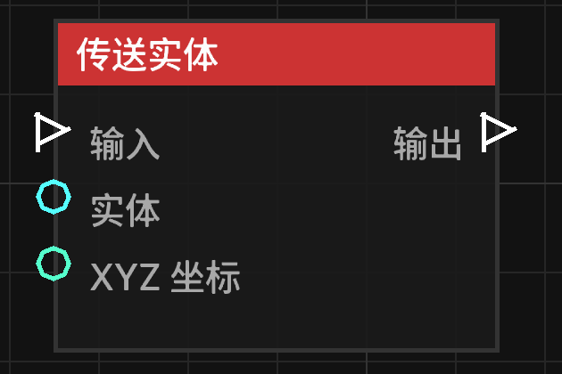

# 传送实体 (Teleport Entity)

**传送实体** 节点允许将指定的实体瞬间转移到目标坐标。

## 节点概览
- **分类**: 动作 > 实体动作
- **内部ID**：`mgmc:teleport_entity`
- 

## 端口定义

### 输入 (Inputs)
| 端口名称 | 类型 | 说明 |
| :--- | :--- | :--- |
| **输入** (Exec) | 执行流 | 触发该节点的运行。 |
| **目标实体** (Entity) | 实体 (Entity) | 要被传送的实体。如果未连接，则默认尝试传送触发蓝图的实体。 |
| **目标坐标** (XYZ) | 坐标 (XYZ) | 实体要传送到的具体空间位置。 |

### 输出 (Outputs)
| 端口名称 | 类型 | 说明 |
| :--- | :--- | :--- |
| **输出** (Exec) | 执行流 | 节点逻辑执行完毕后，触发后续节点的运行。 |

## 行为说明
1. **实体回退机制**：如果“目标实体”端口没有输入，节点会尝试获取蓝图的触发者（Trigger Entity）进行传送。
