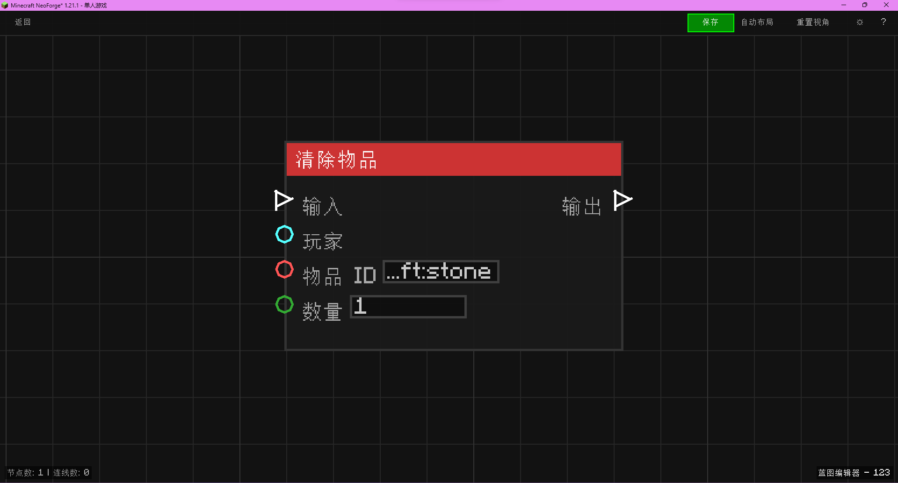

# 清除物品 (Clear Item)

清除玩家背包中的指定物品或清空背包。

## 节点概览
- **分类**: 动作 > 物品操作
- **内部ID**：`mgmc:clear_item`
- 

## 端口定义

### 输入 (Inputs)
| 端口名称 | 类型 | 说明 |
| :--- | :--- | :--- |
| **输入** (In) | 执行流 (Exec) | 触发节点的执行信号。 |
| **玩家** (Player) | 实体 (Entity) | 目标玩家实体。必须是玩家类型。 |
| **物品ID** (Item ID) | 字符串 (String) | 要清除的物品注册名（如 `minecraft:dirt`）。 |
| **数量** (Count) | 整数 (Integer) | 清除的数量。如果小于等于 0，则清除该物品的所有实例。 |

### 输出 (Outputs)
| 端口名称 | 类型 | 说明 |
| :--- | :--- | :--- |
| **输出** (Out) | 执行流 (Exec) | 清除操作完成后触发。 |

## 行为说明
1. **主要行为**：
    - 当节点被触发时，检查输入的玩家实体。
    - 根据物品 ID 查找对应的物品。
    - 如果数量大于 0，则从玩家背包中移除指定数量的该物品。
    - 如果数量小于或等于 0，则移除玩家背包中所有的该物品。
    - 操作完成后会同步玩家背包数据。
2. **特殊情况**：
    - 如果输入的实体不是玩家，不执行操作。
    - 如果物品 ID 无效，不执行操作。
    - 如果玩家背包中没有该物品，不产生影响。
3. **注意事项**：
    - 仅在服务端有效。
    - 此操作会更新客户端背包显示。
