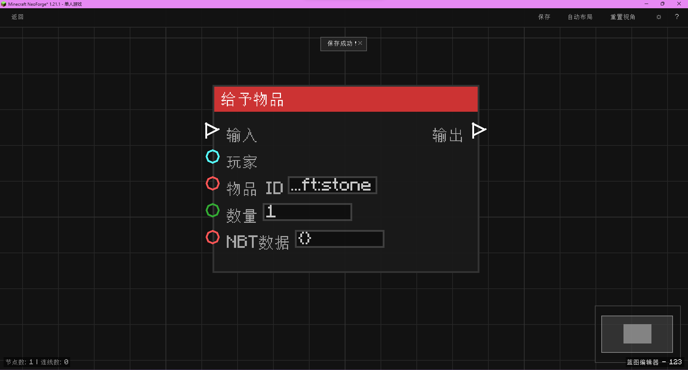

# 给予物品 (Give Item)

给予指定玩家物品（支持指定数量、NBT标签可选）。

## 节点概览
- **分类**: 动作 > 物品操作
- **内部ID**：`mgmc:give_item`
- 

## 端口定义

### 输入 (Inputs)
| 端口名称 | 类型 | 说明 |
| :--- | :--- | :--- |
| **输入** (In) | 执行流 (Exec) | 触发节点的执行信号。 |
| **玩家** (Player) | 实体 (Entity) | 目标玩家实体。必须是玩家类型。 |
| **物品ID** (Item ID) | 字符串 (String) | 物品的注册名（如 `minecraft:diamond`）。 |
| **数量** (Count) | 整数 (Integer) | 给予的物品数量。默认为 1。 |
| **NBT数据** (NBT Data) | 字符串 (String) | 物品的 NBT 标签（JSON 格式字符串）。默认为 `{}`。 |

### 输出 (Outputs)
| 端口名称 | 类型 | 说明 |
| :--- | :--- | :--- |
| **输出** (Out) | 执行流 (Exec) | 给予物品操作完成后触发。 |

## 行为说明
1. **主要行为**：
    - 当节点被触发时，尝试解析输入的玩家实体。
    - 根据提供的物品 ID 和数量创建物品堆叠。
    - 如果提供了有效的 NBT 数据字符串，尝试解析并应用到物品上。
    - 将物品添加到玩家的背包中。
2. **特殊情况**：
    - 如果输入的实体不是玩家（`ServerPlayer`），则不执行任何操作。
    - 如果物品 ID 无效（解析为 `minecraft:air`），则不给予物品。
    - 如果 NBT 字符串格式错误，将忽略 NBT 并给予普通物品。
3. **注意事项**：
    - 仅在服务端有效。
    - 如果玩家背包已满，物品可能会掉落在玩家脚下（取决于 Minecraft 原版逻辑，通常 `add` 方法会尝试添加，失败则可能丢失或保留，具体取决于 `Inventory.add` 的实现，通常会自动处理堆叠）。
