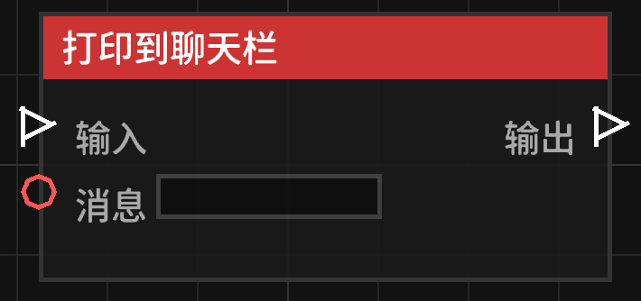

# 打印到聊天栏 (Print to Chat)

**打印到聊天栏** 节点允许你在游戏中向玩家发送系统消息。

## 节点概览
- **分类**: 动作 > 玩家动作
- **内部ID**：`mgmc:print_chat`
- 

## 端口定义

### 输入 (Inputs)
| 端口名称 | 类型 | 说明 |
| :--- | :--- | :--- |
| **输入** (Exec) | 执行流 | 触发该节点的运行。 |
| **消息** (Message) | 字符串 (String) | 要发送到聊天栏的内容。支持连接字符串变量。 |

### 输出 (Outputs)
| 端口名称 | 类型 | 说明 |
| :--- | :--- | :--- |
| **输出** (Exec) | 执行流 | 节点逻辑执行完毕后，触发后续节点的运行。 |

## 行为说明
该节点的发送对象取决于蓝图的**触发上下文**：

1. **玩家触发**：如果蓝图是由某个玩家触发的（例如：`当玩家左键点击方块时`），消息将**仅发送给该玩家**。
2. **非玩家触发**：如果蓝图是由全局事件或非玩家实体触发的，消息将**广播给服务器上的所有玩家**。