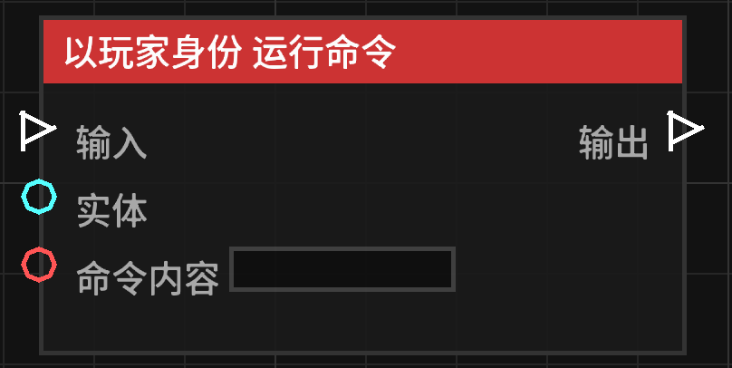

# 以玩家身份 运行命令 (Run Command as Player)

**以玩家身份 运行命令** 节点允许蓝图模拟特定玩家执行一条 Minecraft 指令。

## 节点概览
- **分类**: 动作 > 玩家动作
- **内部ID**：`mgmc:run_command_as_player`
- 

## 端口定义

### 输入 (Inputs)
| 端口名称 | 类型 | 说明 |
| :--- | :--- | :--- |
| **输入** (Exec) | 执行流 | 触发该节点的运行。 |
| **目标实体** (Entity) | 实体 (Entity) | 指定执行命令的玩家。如果不连接，默认使用触发该蓝图的玩家。 |
| **指令内容** (Command) | 字符串 (String) | 要执行的命令（例如：`tp @s ~ ~10 ~`）。开头的 `/` 可写可不写。 |

### 输出 (Outputs)
| 端口名称 | 类型 | 说明 |
| :--- | :--- | :--- |
| **输出** (Exec) | 执行流 | 节点逻辑执行完毕后，触发后续节点的运行。 |

## 行为说明
1. **权限限制**：遵循玩家的权限等级。
2. **执行者锁定**：
    - 如果连接了 **目标实体**，且该实体是玩家，则由该玩家执行。
    - 如果未连接 **目标实体**，则尝试由触发事件的玩家（触发者）执行。
    - 如果两者都无法获取到有效的玩家，该节点将跳过执行。
3. **命令格式**：节点会自动处理命令开头的斜杠 `/`
