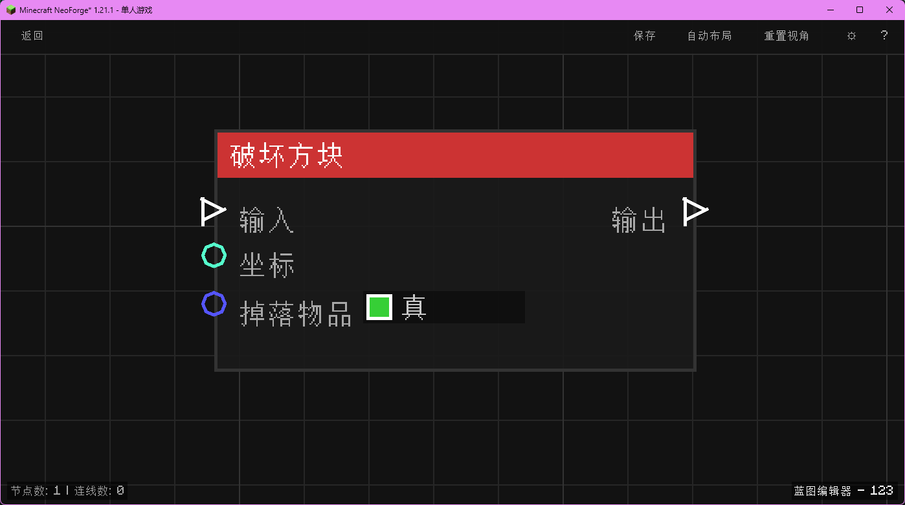

# 破坏方块 (Break Block)

破坏指定坐标的方块，可选择是否掉落物品。

## 节点概览
- **分类**: 动作 > 世界
- **内部ID**：`mgmc:break_block`
- 

## 端口定义

### 输入 (Inputs)
| 端口名称 | 类型 | 说明 |
| :--- | :--- | :--- |
| **执行流** (In) | 执行流 (Exec) | 触发节点执行。 |
| **坐标** (XYZ) | 坐标 (XYZ) | 要破坏的方块位置。 |
| **掉落物品** (Drop) | 布尔 (Boolean) | 是否掉落方块物品（True=掉落，False=不掉落）。 |

### 输出 (Outputs)
| 端口名称 | 类型 | 说明 |
| :--- | :--- | :--- |
| **执行流** (Out) | 执行流 (Exec) | 破坏完成后继续执行。 |

## 行为说明
1. **主要行为**：模拟玩家或环境破坏方块。
2. **特殊情况**：如果是空气方块，无效果。
