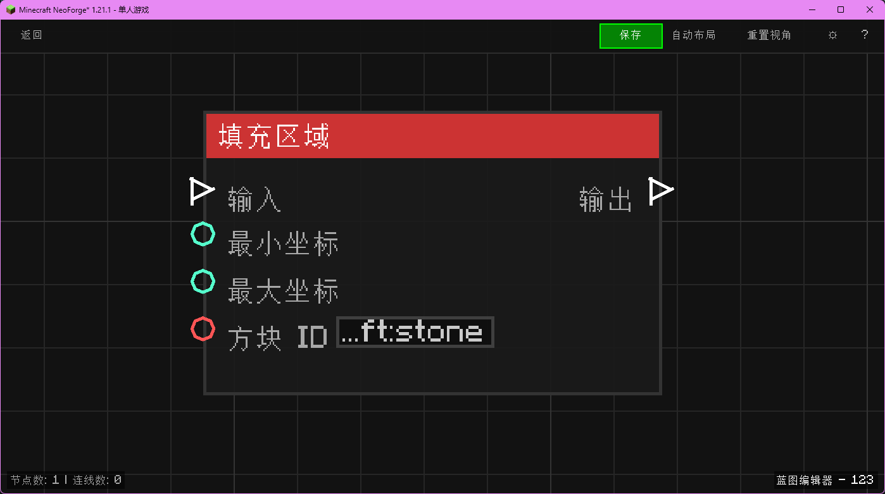

# 填充区域 (Fill Area)

在两个坐标点之间的长方体区域内填充指定方块。

## 节点概览
- **分类**: 动作 > 世界
- **内部ID**：`mgmc:fill_area`
- 

## 端口定义

### 输入 (Inputs)
| 端口名称 | 类型 | 说明 |
| :--- | :--- | :--- |
| **执行流** (In) | 执行流 (Exec) | 触发节点执行。 |
| **最小坐标** (Min Pos) | 坐标 (XYZ) | 区域的一个角点。 |
| **最大坐标** (Max Pos) | 坐标 (XYZ) | 区域的对角点。 |
| **方块 ID** (Block ID) | 字符串 (String) | 要填充的方块 ID。 |

### 输出 (Outputs)
| 端口名称 | 类型 | 说明 |
| :--- | :--- | :--- |
| **执行流** (Out) | 执行流 (Exec) | 填充完成后继续执行。 |

## 行为说明
1. **主要行为**：遍历最小坐标到最大坐标之间的所有方块位置，将其设置为指定方块。
2. **特殊情况**：此节点无体积限制，请谨慎使用以免造成卡顿。
3. **注意事项**：坐标会自动计算 Min/Max，所以两个点的顺序不影响结果。
