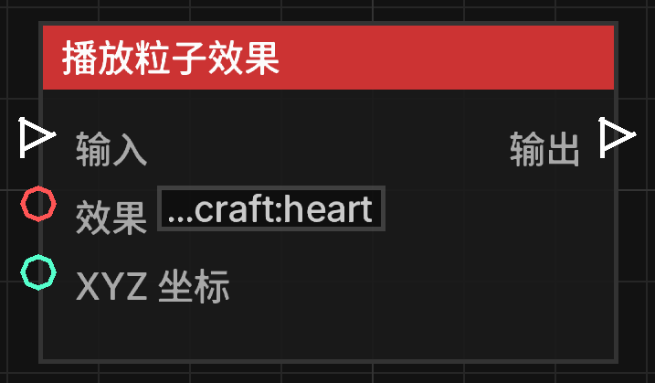

# 播放特效 (Play Effect)

**播放特效** 节点允许在世界中的指定坐标播放 Minecraft 的粒子特效。

## 节点概览
- **分类**: 动作 > 世界动作
- **内部ID**：`mgmc:play_effect`
- 

## 端口定义

### 输入 (Inputs)
| 端口名称 | 类型 | 说明 |
| :--- | :--- | :--- |
| **输入** (Exec) | 执行流 | 触发该节点的运行。 |
| **粒子名称** (Effect) | 字符串 (String) | 要播放的粒子 ID（如 `minecraft:heart`）。默认为爱心。 |
| **坐标** (XYZ) | 坐标 (XYZ) | 粒子播放的具体空间位置。 |

### 输出 (Outputs)
| 端口名称 | 类型 | 说明 |
| :--- | :--- | :--- |
| **输出** (Exec) | 执行流 | 节点逻辑执行完毕后，触发后续节点的运行。 |

## 行为说明
1. **粒子效果**：该节点会在指定坐标处生成一簇粒子特效。
2. **有效性检查**：输入的粒子名称必须是有效的 Minecraft 粒子 ID。如果 ID 错误或不存在，节点将不会产生任何视觉效果。
3. **服务端执行**：该节点在服务端执行并自动向周围玩家同步粒子数据。
