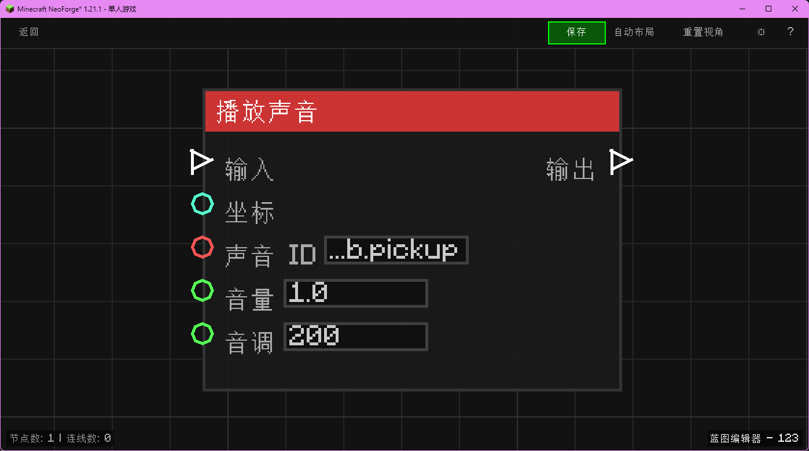

# 播放声音 (Play Sound)

在指定坐标播放声音。

## 节点概览
- **分类**: 动作 > 世界
- **内部ID**：`mgmc:play_sound`
- 

## 端口定义

### 输入 (Inputs)
| 端口名称 | 类型 | 说明 |
| :--- | :--- | :--- |
| **执行流** (In) | 执行流 (Exec) | 触发节点执行。 |
| **坐标** (XYZ) | 坐标 (XYZ) | 播放声音的位置。 |
| **声音 ID** (Sound ID) | 字符串 (String) | 声音的注册 ID（如 `minecraft:entity.experience_orb.pickup`）。 |
| **音量** (Volume) | 浮点 (Float) | 声音大小（1.0 为正常）。 |
| **音调** (Pitch) | 浮点 (Float) | 声音频率/音高（1.0 为正常）。 |

### 输出 (Outputs)
| 端口名称 | 类型 | 说明 |
| :--- | :--- | :--- |
| **执行流** (Out) | 执行流 (Exec) | 播放完成后继续执行。 |

## 行为说明
1. **主要行为**：在指定位置播放指定的声音。
2. **特殊情况**：如果声音 ID 不存在，不会发出声音。
