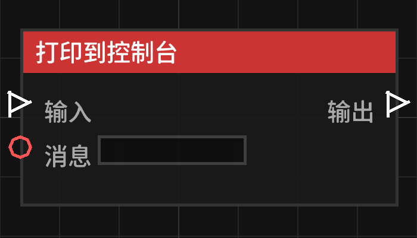

# 打印到控制台 (Print to Log)

**打印到控制台** 节点允许你将调试信息或运行记录输出到服务器后台控制台和游戏内日志。

## 节点概览
- **分类**: 动作 > 世界动作
- **内部ID**：`mgmc:print_log`
- 

## 端口定义

### 输入 (Inputs)
| 端口名称 | 类型 | 说明 |
| :--- | :--- | :--- |
| **输入** (Exec) | 执行流 | 触发该节点的运行。 |
| **消息** (Message) | 字符串 (String) | 要输出到日志的内容。 |

### 输出 (Outputs)
| 端口名称 | 类型 | 说明 |
| :--- | :--- | :--- |
| **输出** (Exec) | 执行流 | 节点逻辑执行完毕后，触发后续节点的运行。 |

## 行为说明
该节点会将消息同时输出到以下三个地方：

1. **系统控制台**：直接显示在服务器运行窗口中。
2. **服务器日志文件**：记录在 `logs/latest.log` 文件中，方便后续排查。
3. **游戏内日志缓存**：你可以通过在游戏内输入 `/mgmc log` 命令来查看最近的输出，这是最方便的调试方式。

输出格式统一为：`[MGMC Log] [蓝图名称] 你的消息内容`。
