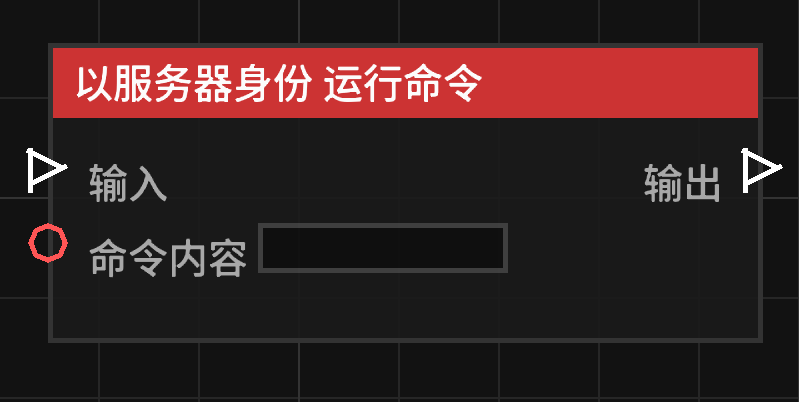

# 以服务器身份 运行命令 (Run Command as Server)

**以服务器身份 运行命令** 节点允许蓝图以服务器控制台的名义执行一条 Minecraft 指令。

## 节点概览
- **分类**: 动作 > 世界动作
- **内部ID**：`mgmc:run_command_as_server`
- 

## 端口定义

### 输入 (Inputs)
| 端口名称 | 类型 | 说明 |
| :--- | :--- | :--- |
| **输入** (Exec) | 执行流 | 触发该节点的运行。 |
| **指令内容** (Command) | 字符串 (String) | 要执行的命令。开头的 `/` 可写可不写。 |

### 输出 (Outputs)
| 端口名称 | 类型 | 说明 |
| :--- | :--- | :--- |
| **输出** (Exec) | 执行流 | 节点逻辑执行完毕后，触发后续节点的运行。 |

## 行为说明
1. **最高权限**：该节点以服务器身份执行，意味着它无视玩家权限，可以执行任何指令
2. **保存限制**：Mod 配置文件中有一个选项 `allow_server_run_command_node`（默认为 `true`）。如果服务器管理员将其设置为 `false`，则任何包含该节点的蓝图都将**无法保存**。
3. **命令格式**：节点会自动处理命令开头的斜杠 `/`。
