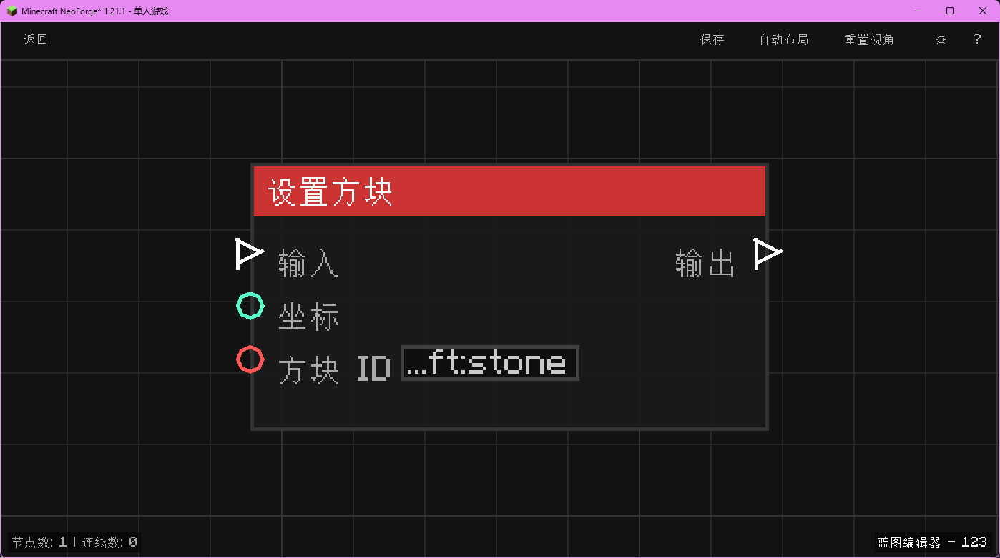

# 设置方块 (Set Block)

在指定坐标设置方块。

## 节点概览
- **分类**: 动作 > 世界
- **内部ID**：`mgmc:set_block`
- 

## 端口定义

### 输入 (Inputs)
| 端口名称 | 类型 | 说明 |
| :--- | :--- | :--- |
| **执行流** (In) | 执行流 (Exec) | 触发节点执行。 |
| **坐标** (XYZ) | 坐标 (XYZ) | 要设置方块的位置。 |
| **方块 ID** (Block ID) | 字符串 (String) | 要设置的方块 ID（如 `minecraft:stone`）。 |

### 输出 (Outputs)
| 端口名称 | 类型 | 说明 |
| :--- | :--- | :--- |
| **执行流** (Out) | 执行流 (Exec) | 设置完成后继续执行。 |

## 行为说明
1. **主要行为**：在指定坐标放置指定的方块。
2. **特殊情况**：如果方块 ID 无效，默认为空气或不进行操作（取决于实现细节，通常是空气）。
3. **注意事项**：此操作会触发方块更新（Flag 3）。
