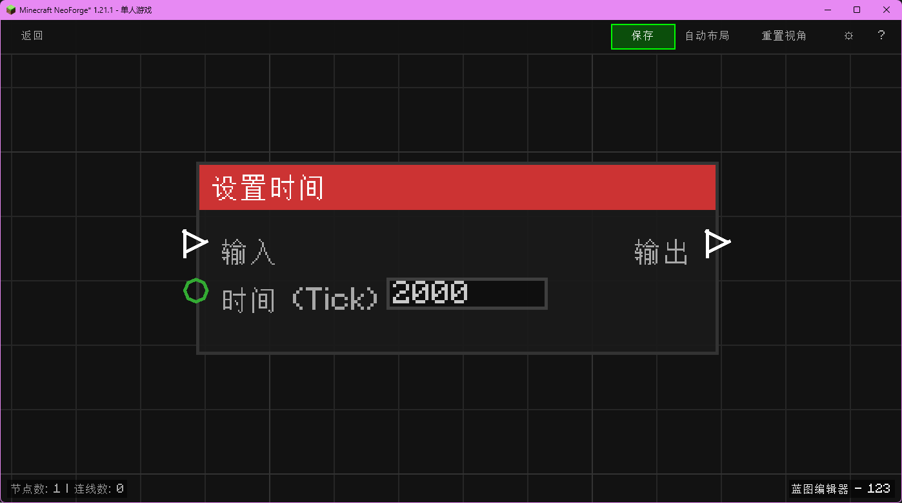

# 设置时间 (Set Time)

设置当前世界的时间。

## 节点概览
- **分类**: 动作 > 世界
- **内部ID**：`mgmc:set_time`
- 

## 端口定义

### 输入 (Inputs)
| 端口名称 | 类型 | 说明 |
| :--- | :--- | :--- |
| **执行流** (In) | 执行流 (Exec) | 触发节点执行。 |
| **时间 (Tick)** (Time) | 整数 (Integer) | 要设置的时间（例如 1000 为早晨，6000 为中午，13000 为晚上，18000 为午夜）。 |

### 输出 (Outputs)
| 端口名称 | 类型 | 说明 |
| :--- | :--- | :--- |
| **执行流** (Out) | 执行流 (Exec) | 设置完成后继续执行。 |

## 行为说明
1. **主要行为**：更改世界时间。
