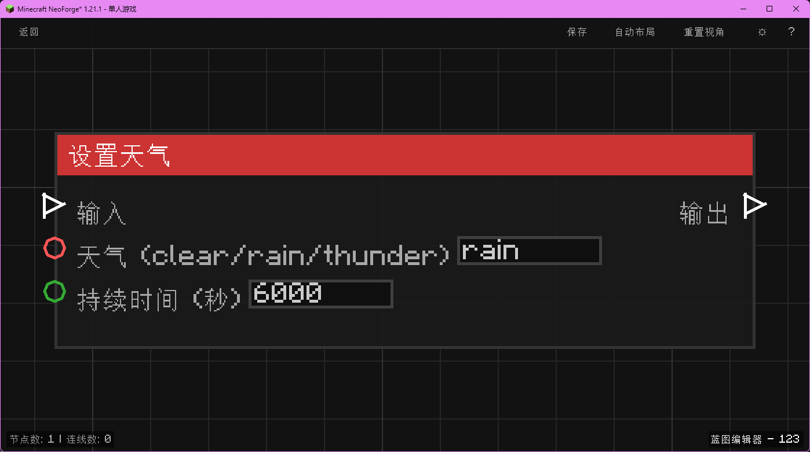

# 设置天气 (Set Weather)

设置世界的天气状态。

## 节点概览
- **分类**: 动作 > 世界
- **内部ID**：`mgmc:set_weather`
- 

## 端口定义

### 输入 (Inputs)
| 端口名称 | 类型 | 说明 |
| :--- | :--- | :--- |
| **执行流** (In) | 执行流 (Exec) | 触发节点执行。 |
| **天气** (Weather) | 字符串 (String) | 目标天气：`clear`、`rain` 或 `thunder`。 |
| **持续时间** (Duration) | 整数 (Integer) | 天气持续的 Tick 数（20 Tick = 1 秒）。 |

### 输出 (Outputs)
| 端口名称 | 类型 | 说明 |
| :--- | :--- | :--- |
| **执行流** (Out) | 执行流 (Exec) | 设置完成后继续执行。 |

## 行为说明
1. **主要行为**：更改世界的天气。
2. **参数说明**：
   - `clear`：清除降雨和雷暴。
   - `rain`：设置下雨。
   - `thunder`：设置雷暴（同时也下雨）。
