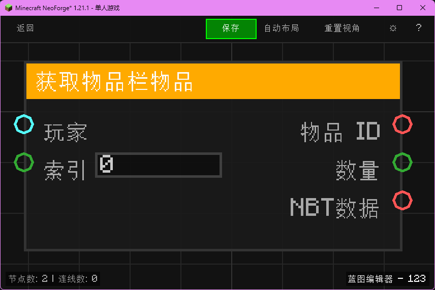

# 获取物品栏物品 (Get Inventory Item)

获取玩家物品栏中指定槽位的物品信息。

## 节点概览
- **分类**: 数据 > 物品数据
- **内部ID**：`mgmc:get_inventory_item`
- 

## 端口定义

### 输入 (Inputs)
| 端口名称 | 类型 | 说明 |
| :--- | :--- | :--- |
| **玩家** (Player) | 实体 (Entity) | 要读取物品栏的玩家实体。 |
| **索引** (Index) | 整数 (Integer) | 物品栏槽位索引（通常 0-40）。 |

### 输出 (Outputs)
| 端口名称 | 类型 | 说明 |
| :--- | :--- | :--- |
| **物品 ID** (Item ID) | 字符串 (String) | 物品的注册ID（例如 `minecraft:diamond`）。 |
| **数量** (Count) | 整数 (Integer) | 物品堆叠数量。 |
| **NBT数据** (NBT) | 字符串 (String) | 物品的 NBT 数据字符串（JSON格式）。 |

## 行为说明
1. **主要行为**：读取指定玩家物品栏在指定索引处的物品，并返回其 ID、数量和 NBT 数据。
2. **特殊情况**：
    - 如果输入的实体不是玩家（`ServerPlayer`），或者索引超出物品栏范围，则返回默认空值（ID为 `minecraft:air`，数量为 0，NBT为 `{}`）。
    - 如果槽位为空，ID返回 `minecraft:air`。
3. **注意事项**：
    - 索引对应 Minecraft 玩家物品栏的槽位 ID。
    - 0-8 为快捷栏，9-35 为背包，36-39 为装备栏，40 为副手（具体视游戏版本而定）。
