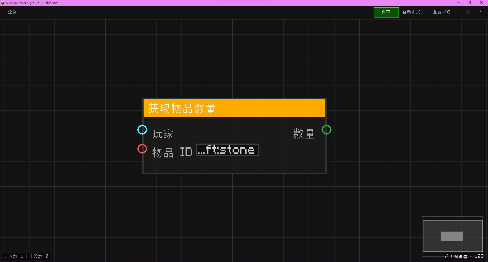

# 获取物品数量 (Get Item Count)

获取玩家背包中某物品的数量。

## 节点概览
- **分类**: 物品数据
- **内部ID**：`mgmc:get_item_count`
- 

## 端口定义

### 输入 (Inputs)
| 端口名称 | 类型 | 说明 |
| :--- | :--- | :--- |
| **玩家** (Player) | 实体 (Entity) | 目标玩家实体。 |
| **物品ID** (Item ID) | 字符串 (String) | 要统计的物品注册名。 |

### 输出 (Outputs)
| 端口名称 | 类型 | 说明 |
| :--- | :--- | :--- |
| **数量** (Count) | 整数 (Integer) | 玩家背包中该物品的总数量。 |

## 行为说明
1. **主要行为**：
    - 读取输入的玩家实体和物品 ID。
    - 遍历玩家背包，统计该物品的总数。
    - 返回统计结果。
2. **特殊情况**：
    - 如果输入的实体不是玩家，返回 0。
    - 如果物品 ID 无效，返回 0。
    - 如果玩家未持有该物品，返回 0。
3. **注意事项**：
    - 仅统计主背包和快捷栏，通常不包括装备栏或副手（取决于 `clearOrCountMatchingItems` 的实现范围，通常包括所有物品栏）。
