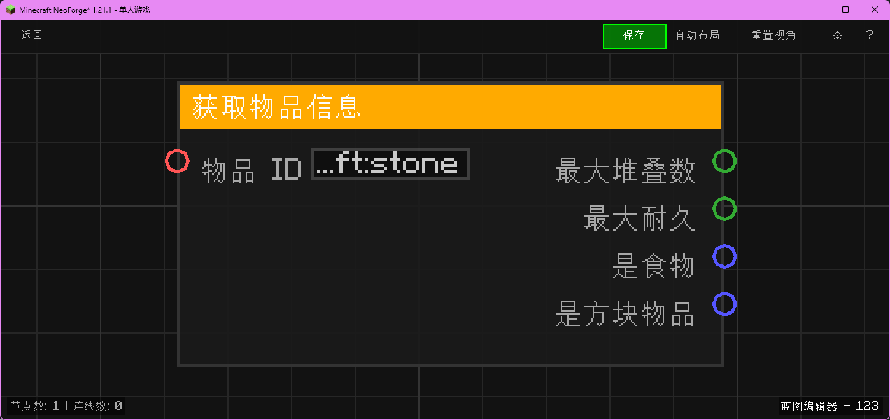

# 获取物品信息 (Get Item Info)

获取指定物品 ID 的基础属性。

## 节点概览
- **分类**: 数据 > 物品栏
- **内部ID**：`mgmc:get_item_info`
- 

## 端口定义

### 输入 (Inputs)
| 端口名称 | 类型 | 说明 |
| :--- | :--- | :--- |
| **物品 ID** (Item ID) | 字符串 (String) | 物品的注册 ID（如 `minecraft:apple`）。 |

### 输出 (Outputs)
| 端口名称 | 类型 | 说明 |
| :--- | :--- | :--- |
| **最大堆叠数** (Max Stack Size) | 整数 (Integer) | 该物品一组最多多少个（通常为 64, 16 或 1）。 |
| **最大耐久** (Max Damage) | 整数 (Integer) | 物品的最大耐久度（无耐久则为 0）。 |
| **是食物** (Is Food) | 布尔 (Boolean) | 该物品是否可食用。 |
| **是方块物品** (Is Block Item) | 布尔 (Boolean) | 该物品是否对应一个方块（可放置）。 |

## 行为说明
1. **主要行为**：查询物品注册表获取物品的静态属性。
2. **特殊情况**：如果物品 ID 无效，返回默认值（0 或 False）。
