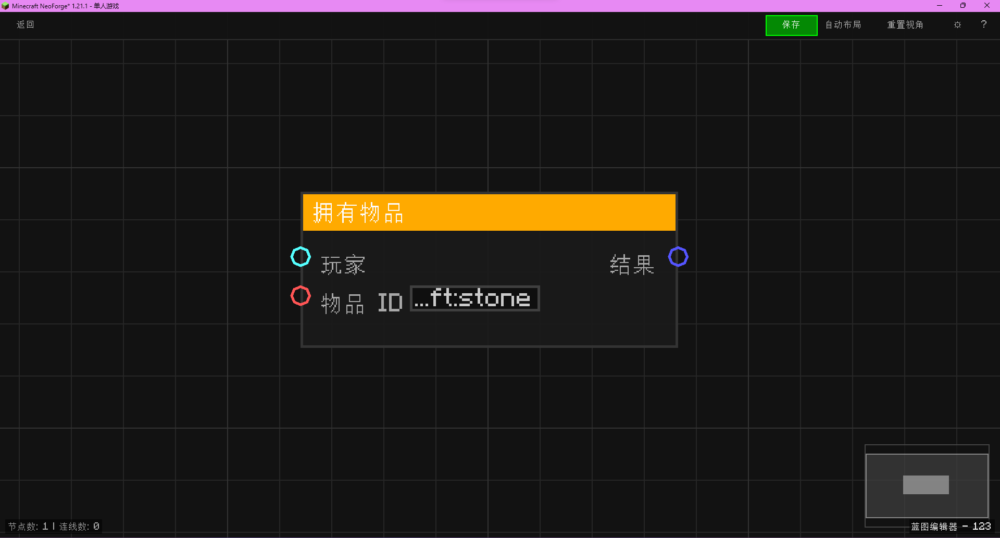

# 拥有物品 (Has Item)

判断玩家是否持有某物品。

## 节点概览
- **分类**: 物品数据
- **内部ID**：`mgmc:has_item`
- 

## 端口定义

### 输入 (Inputs)
| 端口名称 | 类型 | 说明 |
| :--- | :--- | :--- |
| **玩家** (Player) | 实体 (Entity) | 目标玩家实体。 |
| **物品ID** (Item ID) | 字符串 (String) | 要检查的物品注册名。 |

### 输出 (Outputs)
| 端口名称 | 类型 | 说明 |
| :--- | :--- | :--- |
| **结果** (Result) | 布尔值 (Boolean) | 如果玩家持有至少一个该物品，返回 True，否则返回 False。 |

## 行为说明
1. **主要行为**：
    - 检查玩家背包中是否存在指定的物品。
    - 返回布尔值结果。
2. **特殊情况**：
    - 如果输入的实体不是玩家，返回 False。
    - 如果物品 ID 无效，返回 False。
3. **注意事项**：
    - 只要背包中有该物品（无论数量多少），即返回 True。
