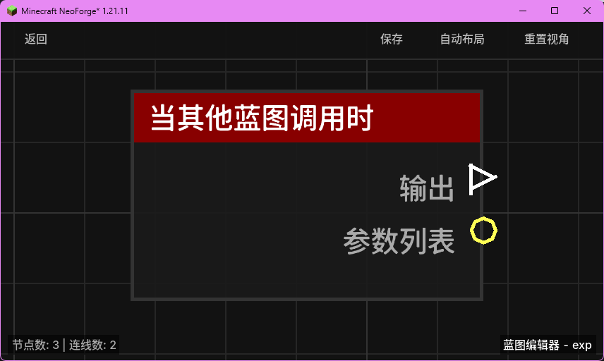

# 当其他蓝图调用时 (When Called by Other Blueprint)

作为蓝图的入口点，当该蓝图被其他蓝图通过“调用本存档其他蓝图”节点调用时触发。

## 节点概览
- **分类**: 事件 > 蓝图事件
- **内部ID**：`mgmc:on_blueprint_called`
- 

## 端口定义

### 输出 (Outputs)
| 端口名称 | 类型 | 说明 |
| :--- | :--- | :--- |
| **输出** (exec_out) | 执行流 (Exec) | 当蓝图被外部调用时触发。 |
| **参数列表** (args_list) | 列表 (List) | 获取调用者传递过来的参数列表。 |

## 行为说明
1. **触发机制**：这是一个事件入口节点。它不能被常规的执行流触发，只能由其他蓝图显式调用。
2. **参数接收**：调用者通过“参数列表”端口传入的所有数据，都会在此节点的 `args_list` 端口以列表形式呈现。
3. **环境数据**：该节点触发时，`ctx`（上下文）中包含了调用者传递的所有触发者信息（如 Entity、XYZ 等）。
4. **返回值建议**：通常建议在由此节点开始的逻辑末尾使用“返回列表到调用蓝图”节点，以便向调用者反馈执行结果。
