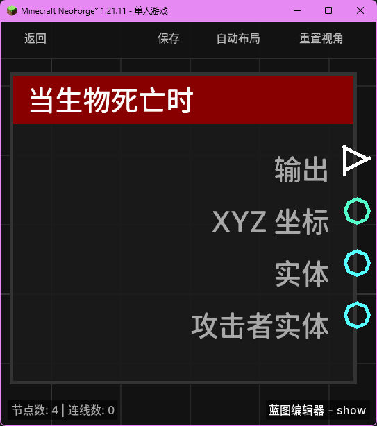

# 当生物死亡时 (on_entity_death)

当任何生物（包括玩家、动物、怪物等）在世界中死亡时触发。

## 节点概览
- **分类**: 事件 > 生物事件
- **内部ID**：`mgmc:on_entity_death`
- 

## 端口定义

### 输入 (Inputs)
该节点没有输入端口。

### 输出 (Outputs)
| 端口名称 | 类型 | 说明 |
| :--- | :--- | :--- |
| **执行** (exec) | 执行流 (Exec) | 当生物死亡时执行后续节点。 |
| **XYZ 坐标** (xyz) | XYZ (XYZ) | 生物死亡时的具体坐标位置。 |
| **实体** (entity) | 实体 (Entity) | 刚刚死亡的生物实体对象。 |
| **攻击者实体** (attacker_entity) | 实体 (Entity) | 造成该生物死亡的直接来源实体（如果是被生物杀死的）。 |

## 行为说明
1. **主要行为**：当世界中的生物生命值降至 0 并触发死亡事件（LivingDeathEvent）时，该节点将被触发。
2. **坐标信息**：**XYZ 坐标 (xyz)** 输出的是该生物死亡瞬间在世界中的精确坐标。
3. **攻击者识别**：**攻击者实体 (attacker_entity)** 用于获取“谁杀了它”。如果是被玩家、僵尸或箭（其所有者）杀死的，该端口将输出对应的实体；如果是摔死、溺水或被仙人掌扎死等环境伤害导致的死亡，该端口将返回 `null`。
4. **空值处理**：
    - **攻击者实体 (attacker_entity)** 在非生物因素导致的死亡时会返回 `null`。在连接后续逻辑（如给予击杀奖励）前，请务必使用“分支”节点判断其是否为空。
5. **类型转换**：
    - **实体 (entity)** 和 **攻击者实体 (attacker_entity)** 端口均支持自动转换为其 UUID 字符串或名称字符串。
    - **XYZ 坐标 (xyz)** 可以自动转换为字符串或分解为单独的 X、Y、Z 数值。
