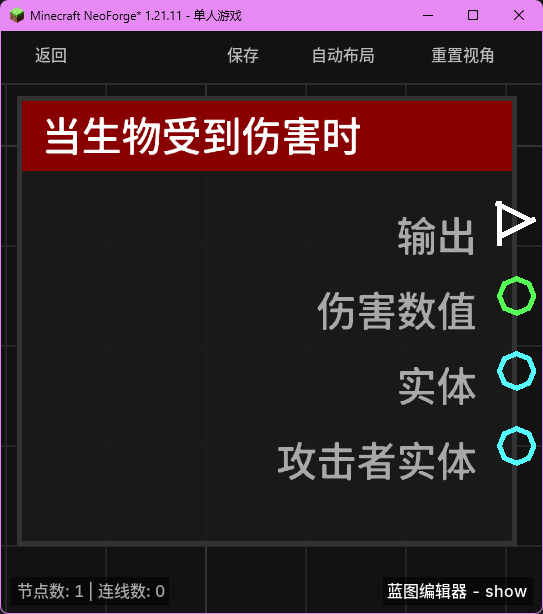

# 当生物受到伤害时 (on_entity_hurt)

当世界中的任何生物受到伤害时触发。

## 节点概览
- **分类**: 事件 > 生物事件
- **内部ID**：`mgmc:on_entity_hurt`
- 

## 端口定义

### 输入 (Inputs)
该节点没有输入端口。

### 输出 (Outputs)
| 端口名称 | 类型 | 说明 |
| :--- | :--- | :--- |
| **执行** (exec) | 执行流 (Exec) | 当生物受到伤害时执行后续节点。 |
| **伤害数值** (damage_amount) | 浮点数 (Float) | 生物本次受到的原始伤害数值。 |
| **实体** (entity) | 实体 (Entity) | 受到伤害的生物实体对象。 |
| **攻击者实体** (attacker_entity) | 实体 (Entity) | 造成伤害的实体来源（如果是被其他生物攻击）。 |

## 行为说明
1. **主要行为**：当任何生物即将受到伤害（LivingIncomingDamageEvent）时，该节点将被触发。这发生在伤害实际扣除生命值之前。
2. **攻击者识别**：**攻击者实体 (attacker_entity)** 用于识别伤害的来源。如果伤害是由另一个实体（如玩家、怪物或投掷物）造成的，该端口将输出对应的实体对象；如果是环境因素（如摔落、火焰、药水效果）造成的伤害，该端口将返回 `null`。
3. **空值处理**：
    - 如果伤害来源不是实体，**攻击者实体 (attacker_entity)** 将输出 `null`。在连接后续逻辑时，请务必进行非空检查。
4. **类型转换**：
    - **伤害数值 (damage_amount)** 可以自动转换为字符串进行显示。
    - **实体 (entity)** 和 **攻击者实体 (attacker_entity)** 均支持自动转换为其名称或 UUID 字符串。
