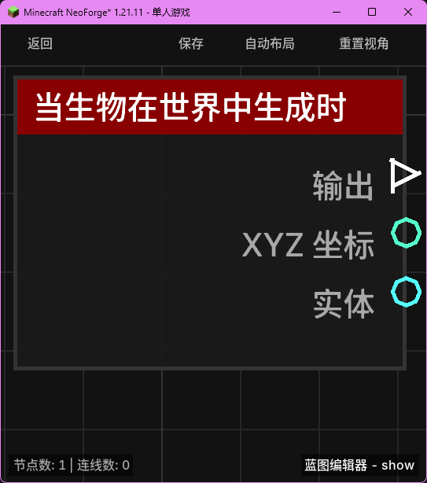

# 当生物在世界中生成时 (on_entity_spawn)

当任何生物（包括玩家、动物、怪物、掉落物等）在世界中生成或加载时触发。

## 节点概览
- **分类**: 事件 > 生物事件
- **内部ID**：`mgmc:on_entity_spawn`
- 

## 端口定义

### 输入 (Inputs)
该节点没有输入端口。

### 输出 (Outputs)
| 端口名称 | 类型 | 说明 |
| :--- | :--- | :--- |
| **执行** (exec) | 执行流 (Exec) | 当生物生成时执行后续节点。 |
| **XYZ 坐标** (xyz) | XYZ (XYZ) | 生物生成时的具体位置坐标。 |
| **实体** (entity) | 实体 (Entity) | 刚刚生成的生物实体对象。 |

## 行为说明
1. **主要行为**：当任何实体加入世界（EntityJoinLevelEvent）时，该节点将被触发。这包括自然生成、刷怪笼生成、玩家进入游戏、以及区块加载导致的实体重新加载。
2. **坐标信息**：**XYZ 坐标 (xyz)** 输出的是实体在加入世界瞬间所在的精确坐标。
3. **实体识别**：**实体 (entity)** 端口输出的是刚加入世界的实体对象。可以通过该端口获取实体的类型、名称或对其施加初始状态。
4. **空值处理**：作为事件触发节点，输出端口在事件发生时始终有效。
5. **类型转换**：
    - **实体 (entity)** 端口支持自动转换为其名称或 UUID 字符串。
    - **XYZ 坐标 (xyz)** 可以自动转换为字符串或分解为单独的 X、Y、Z 数值。
