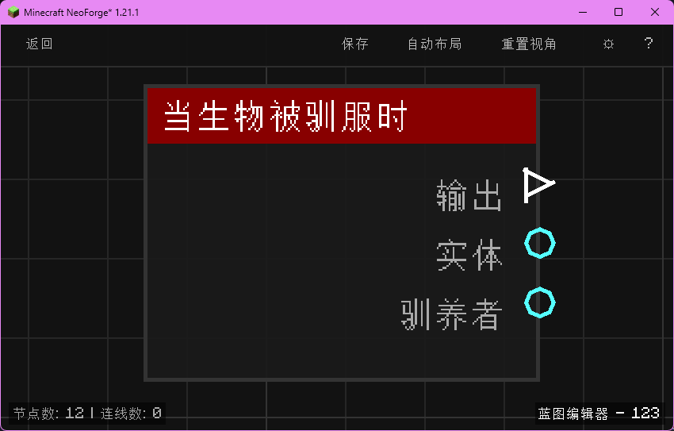

# 当生物被驯服时 (on_entity_tame)

当可驯服生物被驯服时触发，输出被驯服生物与驯养者。

## 节点概览
- **分类**: 事件 > 生物事件
- **内部ID**：`mgmc:on_entity_tame`
- 

## 端口定义

### 输入 (Inputs)
该节点没有输入端口。

### 输出 (Outputs)
| 端口名称 | 类型 | 说明 |
| :--- | :--- | :--- |
| **执行** (exec) | 执行流 (Exec) | 当生物被驯服时执行后续节点。 |
| **实体** (entity) | 实体 (Entity) | 刚被驯服的生物实体（例如狼、豹猫、鹦鹉、马等）。 |
| **驯养者** (tamer) | 实体 (Entity) | 完成驯服动作的玩家实体。 |

## 行为说明
1. **主要行为**：当玩家通过喂食等手段将一个可驯服生物变为已驯服状态时触发，输出被驯服的生物与执行驯服的玩家。
2. **触发时机**：该节点对应 NeoForge 的 `EntityTameEvent`，在动物成功完成驯服流程时触发；玩家喂食但仍未驯服（仍需更多食物）时不会触发。
3. **典型场景**：常用于在玩家驯服宠物后自动给宠物命名、设置宠物属性或广播提示。
4. **路由标识**：使用生物类型的注册名作为路由标识（例如 `minecraft:wolf`），每个生物种类拥有独立的蓝图实例。
5. **空值处理**：作为事件触发节点，输出端口在事件发生时始终有效。**实体 (entity)** 与 **驯养者 (tamer)** 均不为空。
6. **类型转换**：**实体 (entity)** 与 **驯养者 (tamer)** 端口均支持自动转换为其 UUID 字符串或名称字符串。