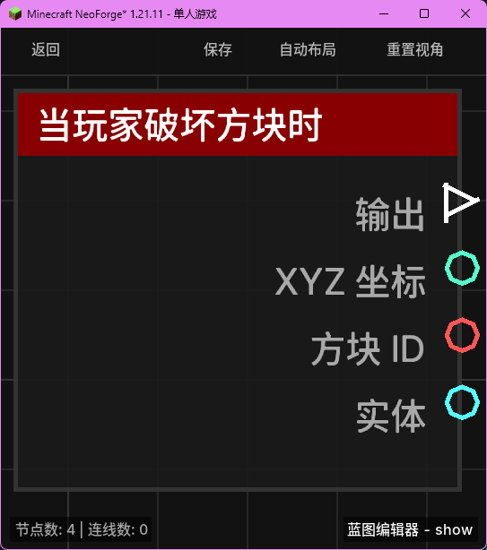

# 当玩家破坏方块时 (on_break_block)

当玩家在生存模式下成功破坏一个方块，或在创造模式下点击破坏方块时触发。

## 节点概览
- **分类**: 事件 > 玩家事件
- **内部ID**：`mgmc:on_break_block`
- 

## 端口定义

### 执行流 (Exec)
| 端口名称 | 类型 | 说明 |
| :--- | :--- | :--- |
| **执行输出** (exec_out) | 执行流 (Exec) | 方块被破坏时激活后续逻辑。 |

### 输出 (Outputs)
| 端口名称 | 类型 | 说明 |
| :--- | :--- | :--- |
| **XYZ** (xyz) | XYZ (XYZ) | 被破坏方块的坐标位置。 |
| **方块 ID** (block_id) | 字符串 (String) | 被破坏方块的命名空间 ID（例如 `minecraft:stone`）。 |
| **实体** (entity) | 实体 (Entity) | 破坏方块的玩家实体。 |

## 行为说明
1. **触发时机**：该事件在方块实际被移除前触发。如果破坏动作被其他插件或 Mod 取消，该节点可能不会执行。
2. **过滤机制**：在蓝图配置中，可以将此蓝图绑定到特定的方块 ID。只有当破坏的方块匹配绑定的 ID 时，该事件才会触发。
3. **坐标信息**：输出的 XYZ 是方块在世界中的精确整数坐标。
