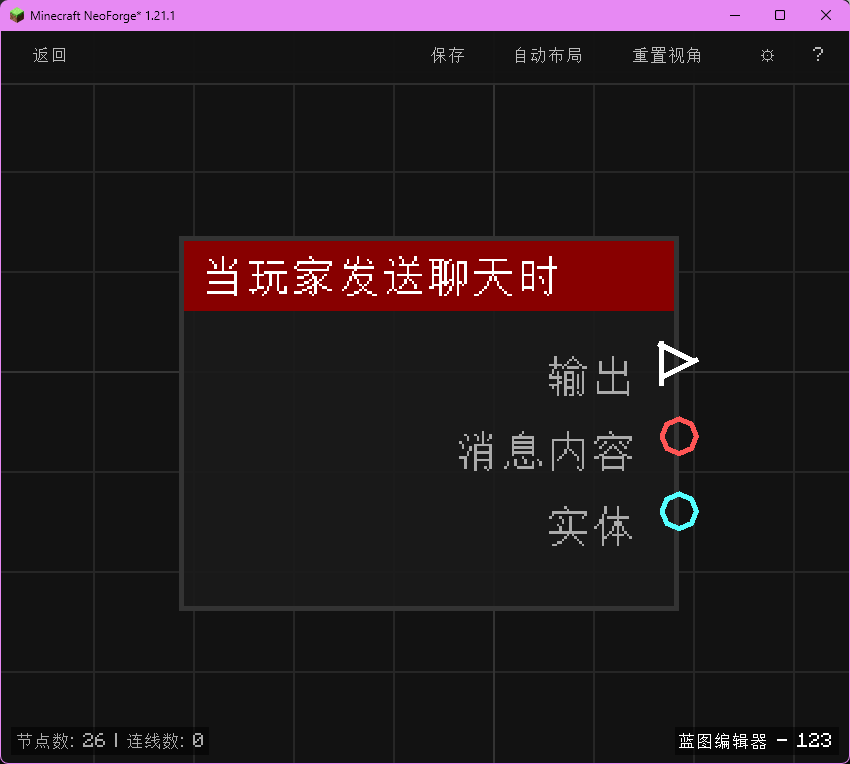

# 当执行指令时 (on_command_perform)

当任意指令（含玩家、命令方块等）被执行时触发，输出指令内容与来源玩家（若有）。

## 节点概览
- **分类**: 事件 > 玩家事件
- **内部ID**：`mgmc:on_command_perform`
- 

## 端口定义

### 输入 (Inputs)
该节点没有输入端口。

### 输出 (Outputs)
| 端口名称 | 类型 | 说明 |
| :--- | :--- | :--- |
| **执行** (exec) | 执行流 (Exec) | 当指令被触发时执行后续节点。 |
| **命令内容** (command) | 字符串 (String) | 被执行的完整命令字符串（含前导斜杠，例如 `tp Steve 0 64 0`）。 |
| **实体** (entity) | 实体 (Entity) | 执行该指令的来源玩家实体。若指令由命令方块或控制台触发，则输出为空。 |

## 行为说明
1. **主要行为**：捕获服务器内任意指令的执行动作（玩家手动执行、命令方块执行、控制台执行均会触发），并暴露命令内容与触发来源玩家。
2. **触发时机**：该节点在指令逻辑真正执行之前触发，因此可以在此处拦截并修改游戏逻辑；不会因命令失败（如权限不足、语法错误）而取消触发。
3. **命令内容**：**命令内容 (command)** 输出的字符串不包含前导的 `/`，但包含所有参数（例如 `gamemode creative`）。
4. **路由标识**：使用 `BlueprintRouter.GLOBAL_ID` 路由，作为全局蓝图运行，不会跟随特定玩家上下文。
5. **空值处理**：**实体 (entity)** 在指令由命令方块或控制台触发时为空；**命令内容 (command)** 始终为非空字符串。
6. **类型转换**：**实体 (entity)** 端口支持自动转换为其 UUID 字符串或名称字符串；当实体为空时转换结果为空字符串。