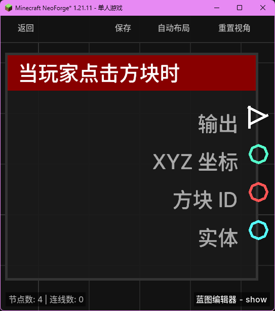

# 当玩家点击方块时 (on_interact_block)

当玩家右键点击一个方块时触发。

## 节点概览
- **分类**: 事件 > 玩家事件
- **内部ID**：`mgmc:on_interact_block`
- 

## 端口定义

### 执行流 (Exec)
| 端口名称 | 类型 | 说明 |
| :--- | :--- | :--- |
| **执行输出** (exec_out) | 执行流 (Exec) | 玩家点击方块时激活后续逻辑。 |

### 输出 (Outputs)
| 端口名称 | 类型 | 说明 |
| :--- | :--- | :--- |
| **XYZ** (xyz) | XYZ (XYZ) | 被点击方块的坐标位置。 |
| **方块 ID** (block_id) | 字符串 (String) | 被点击方块的命名空间 ID（例如 `minecraft:chest`）。 |
| **实体** (entity) | 实体 (Entity) | 点击方块的玩家实体。 |

## 行为说明
1. **触发行为**：该节点对应 Minecraft 的右键交互（Right Click Block）行为。无论是打开容器、使用开关还是使用手中的物品点击方块，都会触发此节点。
2. **过滤机制**：在蓝图配置中，可以将此蓝图绑定到特定的方块 ID。只有当点击的方块匹配绑定的 ID 时，该事件才会触发。
3. **交互上下文**：该事件提供点击方块的精确坐标，方便实现针对特定位置方块的逻辑处理。
