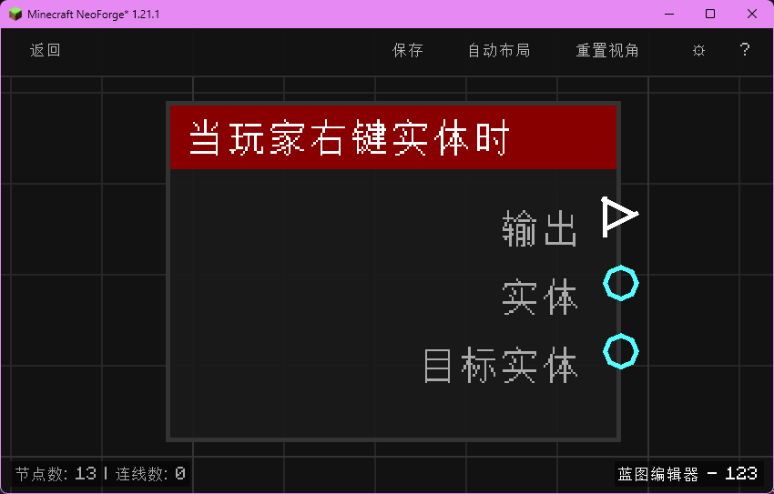

# 当玩家右键实体时 (on_interact_entity)

当玩家右键点击某个实体时触发，输出玩家实体与被交互的实体。

## 节点概览
- **分类**: 事件 > 玩家事件
- **内部ID**：`mgmc:on_interact_entity`
- 

## 端口定义

### 输入 (Inputs)
该节点没有输入端口。

### 输出 (Outputs)
| 端口名称 | 类型 | 说明 |
| :--- | :--- | :--- |
| **执行** (exec) | 执行流 (Exec) | 当玩家右键点击实体时执行后续节点。 |
| **实体** (entity) | 实体 (Entity) | 发起右键点击的玩家实体。 |
| **目标实体** (target_entity) | 实体 (Entity) | 被玩家右键点击的目标实体。 |

## 行为说明
1. **主要行为**：当玩家在世界中右键点击任意实体时触发，输出触发玩家与被点击的实体。
2. **触发时机**：该节点对应 NeoForge 的 `EntityInteractEvent`，包含玩家空击（未指向实体）以外的实体交互动作。
3. **典型场景**：常用于实现村民交易提示、宠物互动、坐骑上马等需要识别玩家对某个实体的右键交互。
4. **路由标识**：使用 `BlueprintRouter.PLAYERS_ID` 路由，每个玩家的蓝图实例独立运行。
5. **空值处理**：作为事件触发节点，输出端口在事件发生时始终有效。**实体 (entity)** 与 **目标实体 (target_entity)** 均不为空。
6. **类型转换**：**实体 (entity)** 与 **目标实体 (target_entity)** 端口均支持自动转换为其 UUID 字符串或名称字符串。