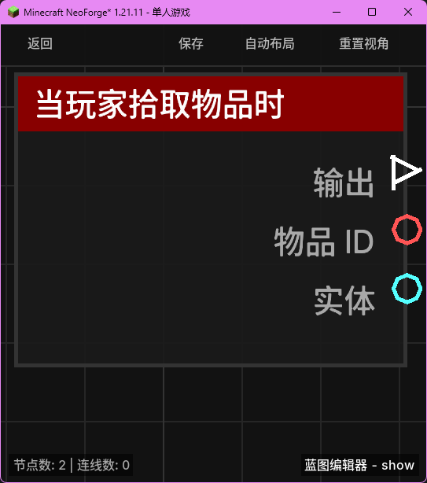

# 当玩家拾取物品时 (on_item_pickup)

当玩家在世界中拾取掉落物并将其放入背包后触发。

## 节点概览
- **分类**: 事件 > 玩家事件
- **内部ID**：`mgmc:on_item_pickup`
- 

## 端口定义

### 输入 (Inputs)
该节点没有输入端口。

### 输出 (Outputs)
| 端口名称 | 类型 | 说明 |
| :--- | :--- | :--- |
| **执行** (exec) | 执行流 (Exec) | 当物品拾取成功后执行后续节点。 |
| **物品 ID** (item_id) | 字符串 (String) | 被拾取的物品命名空间 ID（例如 `minecraft:diamond`）。 |
| **实体** (entity) | 实体 (Entity) | 拾取物品的玩家实体。 |

## 行为说明
1. **主要行为**：当玩家走过掉落物并成功将其收入背包时，该节点将被触发。
2. **触发时机**：该节点对应 NeoForge 的 `ItemEntityPickupEvent.Post` 事件，意味着只有在拾取动作实际完成后才会触发。
3. **物品信息**：**物品 ID (item_id)** 输出的是物品的注册名，不包含物品的数量或 NBT 信息。
4. **空值处理**：作为事件触发节点，输出端口在事件发生时始终有效。
5. **类型转换**：**实体 (entity)** 端口支持自动转换为其 UUID 字符串或名称字符串。
