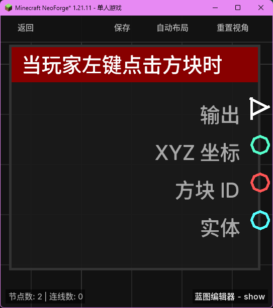

# 当玩家左键点击方块时 (on_left_click_block)

当玩家左键点击（通常是试图挖掘）一个方块时触发。

## 节点概览
- **分类**: 事件 > 玩家事件
- **内部ID**：`mgmc:on_left_click_block`
- 

## 端口定义

### 输入 (Inputs)
该节点没有输入端口。

### 输出 (Outputs)
| 端口名称 | 类型 | 说明 |
| :--- | :--- | :--- |
| **执行** (exec) | 执行流 (Exec) | 当方块被左键点击时执行后续节点。 |
| **XYZ 坐标** (xyz) | XYZ (XYZ) | 被点击方块的坐标位置。 |
| **方块 ID** (block_id) | 字符串 (String) | 被点击方块的命名空间 ID（例如 `minecraft:stone`）。 |
| **实体** (entity) | 实体 (Entity) | 执行点击动作的玩家实体。 |

## 行为说明
1. **主要行为**：当玩家在生存模式下试图挖掘方块，或在创造模式下瞬间破坏方块前进行点击时，该节点将被触发。
2. **触发频率**：在生存模式下持续按住左键时，该事件通常只在开始点击时触发一次。
3. **方块识别**：**方块 ID (block_id)** 输出的是点击瞬间该位置的方块类型。
4. **空值处理**：作为事件触发节点，输出端口在事件发生时始终有效。
5. **类型转换**：
    - **XYZ 坐标 (xyz)** 可以自动转换为字符串或分解为 X、Y、Z 分量。
    - **实体 (entity)** 端口支持自动转换为其 UUID 字符串或名称字符串。
