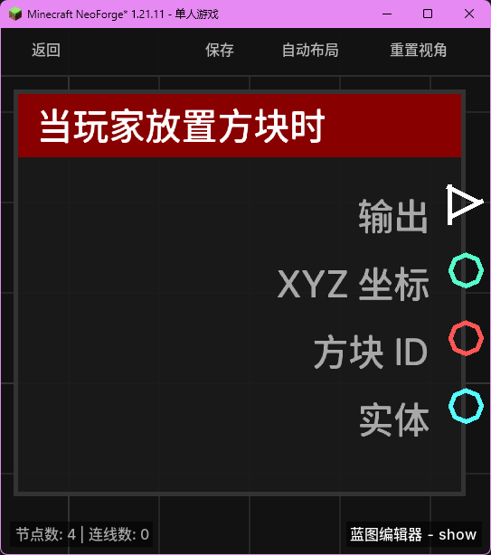

# 当玩家放置方块时 (on_place_block)

当玩家在世界中成功放置一个方块时触发。

## 节点概览
- **分类**: 事件 > 玩家事件
- **内部ID**：`mgmc:on_place_block`
- 

## 端口定义

### 执行流 (Exec)
| 端口名称 | 类型 | 说明 |
| :--- | :--- | :--- |
| **执行输出** (exec_out) | 执行流 (Exec) | 方块被放置时激活后续逻辑。 |

### 输出 (Outputs)
| 端口名称 | 类型 | 说明 |
| :--- | :--- | :--- |
| **XYZ** (xyz) | XYZ (XYZ) | 放置方块的目标坐标位置。 |
| **方块 ID** (block_id) | 字符串 (String) | 被放置方块的命名空间 ID（例如 `minecraft:stone`）。 |
| **实体** (entity) | 实体 (Entity) | 放置方块的玩家实体。 |

## 行为说明
1. **触发条件**：仅当实体是玩家且成功放置方块时触发。如果是通过机器或其他非玩家手段放置的方块，该节点不会执行。
2. **过滤机制**：可以在蓝图设置中将此事件绑定到特定的方块 ID。只有当放置的方块与绑定的 ID 一致时，才会触发该蓝图。
3. **位置信息**：输出的 XYZ 是方块在世界中的精确坐标。
