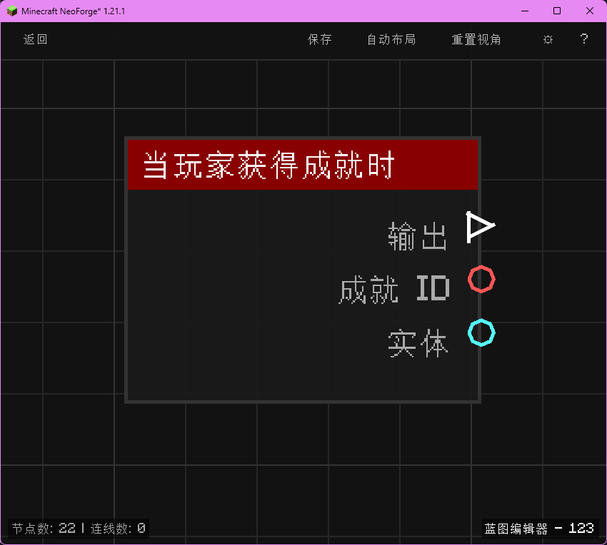

# 当玩家获得成就时 (on_player_advancement)

当玩家完成某个进度（成就）时触发，输出成就 ID 与玩家实体。

## 节点概览
- **分类**: 事件 > 玩家事件
- **内部ID**：`mgmc:on_player_advancement`
- 

## 端口定义

### 输入 (Inputs)
该节点没有输入端口。

### 输出 (Outputs)
| 端口名称 | 类型 | 说明 |
| :--- | :--- | :--- |
| **执行** (exec) | 执行流 (Exec) | 当玩家获得成就时执行后续节点。 |
| **成就 ID** (advancement_id) | 字符串 (String) | 成就的命名空间 ID（例如 `minecraft:story/mine_diamond`）。 |
| **实体** (entity) | 实体 (Entity) | 获得该成就的玩家实体。 |

## 行为说明
1. **主要行为**：当玩家完成 Minecraft 中的任意成就（进度）时触发，输出对应的成就 ID 与玩家实体。
2. **触发时机**：该节点对应 NeoForge 的 `PlayerAdvancementEvent.AdvancementEarnEvent`，仅在玩家真正达成条件时触发。
3. **成就 ID 格式**：**成就 ID (advancement_id)** 输出的是带命名空间前缀的完整成就标识，例如 `minecraft:story/mine_diamond` 或模组自定义成就的 `modid:path/to/advancement`。
4. **路由标识**：使用 `BlueprintRouter.PLAYERS_ID` 路由，每个玩家的蓝图实例独立运行。
5. **空值处理**：作为事件触发节点，输出端口在事件发生时始终有效。**成就 ID (advancement_id)** 始终为非空字符串。
6. **类型转换**：**实体 (entity)** 端口支持自动转换为其 UUID 字符串或名称字符串。