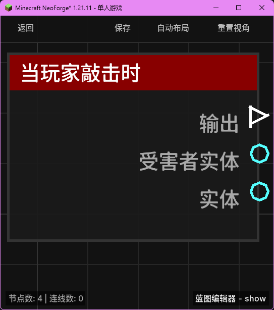

# 当玩家敲击时 (on_player_attack)

当玩家左键攻击（敲击）一个实体时触发。

## 节点概览
- **分类**: 事件 > 玩家事件
- **内部ID**：`mgmc:on_player_attack`
- 

## 端口定义

### 输入 (Inputs)
该节点没有输入端口。

### 输出 (Outputs)
| 端口名称 | 类型 | 说明 |
| :--- | :--- | :--- |
| **执行** (exec) | 执行流 (Exec) | 当玩家攻击实体时执行后续节点。 |
| **受害者实体** (victim_entity) | 实体 (Entity) | 被玩家攻击的目标实体。 |
| **实体** (entity) | 实体 (Entity) | 发起攻击的玩家实体。 |

## 行为说明
1. **主要行为**：当玩家左键点击一个实体并尝试对其造成伤害时，该节点将被触发。
2. **触发时机**：该节点对应 Forge 的 `AttackEntityEvent` 事件。它在攻击意图确定时触发，通常在实际伤害计算之前。
3. **目标识别**：**受害者实体 (victim_entity)** 端口输出被攻击的对象。这可以是任何生物（如村民、怪物、其他玩家）或非生物实体（如盔甲架）。
4. **空值处理**：作为事件触发节点，输出端口在事件发生时始终有效。**受害者实体 (victim_entity)** 将始终返回一个有效的实体对象。
5. **类型转换**：输出的实体端口（**实体** 和 **受害者实体**）均支持自动转换为其 UUID 字符串或名称字符串。
