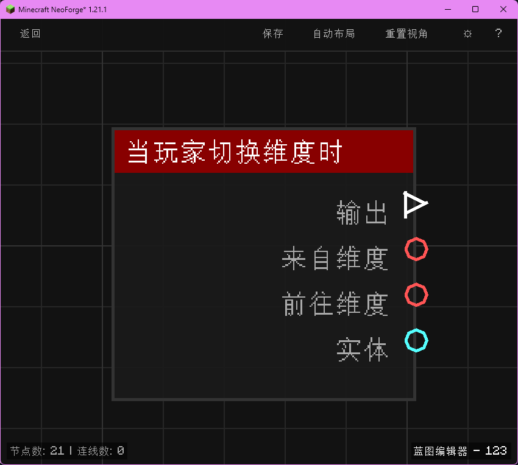

# 当玩家切换维度时 (on_player_change_dimension)

当玩家从一个维度传送到另一个维度时触发，输出来源维度、目标维度与玩家实体。

## 节点概览
- **分类**: 事件 > 玩家事件
- **内部ID**：`mgmc:on_player_change_dimension`
- 

## 端口定义

### 输入 (Inputs)
该节点没有输入端口。

### 输出 (Outputs)
| 端口名称 | 类型 | 说明 |
| :--- | :--- | :--- |
| **执行** (exec) | 执行流 (Exec) | 当玩家切换维度时执行后续节点。 |
| **来自维度** (from_dimension) | 字符串 (String) | 玩家出发时所在维度的命名空间 ID（例如 `minecraft:overworld`）。 |
| **前往维度** (to_dimension) | 字符串 (String) | 玩家目标维度的命名空间 ID（例如 `minecraft:the_nether`）。 |
| **实体** (entity) | 实体 (Entity) | 进行维度切换的玩家实体。 |

## 行为说明
1. **主要行为**：当玩家通过任意方式（下界传送门、末地传送门、`/tp` 跨维度命令、自定义模组传送等）从一个维度切换到另一个维度时触发。
2. **触发时机**：该节点对应 NeoForge 的 `PlayerChangedDimensionEvent`，在玩家实际切换维度成功后触发。
3. **维度 ID 格式**：**来自维度 (from_dimension)** 与 **前往维度 (to_dimension)** 输出均为带命名空间的维度标识，例如 `minecraft:overworld`、`minecraft:the_nether`、`minecraft:the_end`。
4. **路由标识**：使用 `BlueprintRouter.PLAYERS_ID` 路由，每个玩家的蓝图实例独立运行。
5. **空值处理**：作为事件触发节点，输出端口在事件发生时始终有效。**来自维度 (from_dimension)** 与 **前往维度 (to_dimension)** 始终为非空字符串。
6. **类型转换**：**实体 (entity)** 端口支持自动转换为其 UUID 字符串或名称字符串。