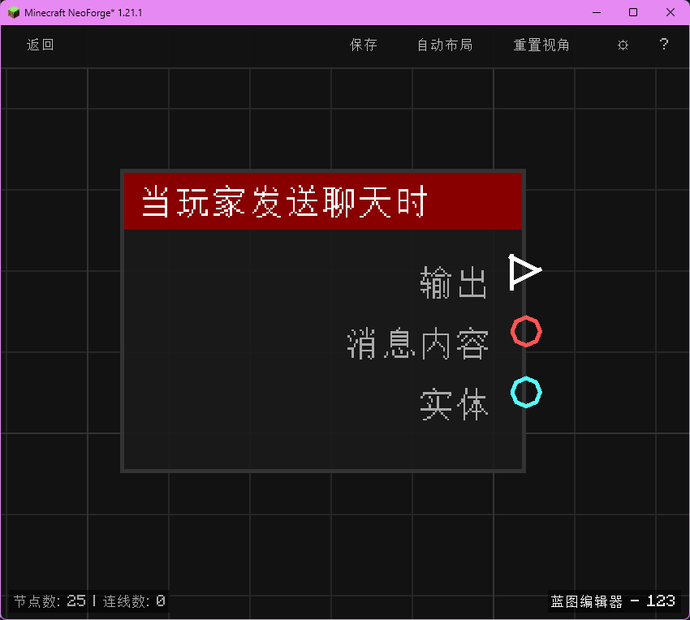

# 当玩家发送聊天时 (on_player_chat)

当玩家发送聊天消息时触发，输出消息内容与玩家实体。

## 节点概览
- **分类**: 事件 > 玩家事件
- **内部ID**：`mgmc:on_player_chat`
- 

## 端口定义

### 输入 (Inputs)
该节点没有输入端口。

### 输出 (Outputs)
| 端口名称 | 类型 | 说明 |
| :--- | :--- | :--- |
| **执行** (exec) | 执行流 (Exec) | 当玩家发送聊天时执行后续节点。 |
| **消息内容** (message) | 字符串 (String) | 玩家发送的聊天消息原文（不含前缀 `>`）。 |
| **实体** (entity) | 实体 (Entity) | 发送该消息的玩家实体（系统消息触发时为空）。 |

## 行为说明
1. **主要行为**：捕获玩家在游戏内聊天栏发送的每条文本消息，输出原文与发送玩家。
2. **触发时机**：该节点对应 NeoForge 的 `ServerChatEvent`，在服务器收到玩家聊天消息后触发，覆盖玩家普通发言。
3. **消息内容**：**消息内容 (message)** 为纯文本字符串，不包含时间戳、玩家名前缀或 JSON 组件，仅保留玩家输入的原始字符。
4. **路由标识**：根据触发来源选择路由——若由玩家触发则使用 `BlueprintRouter.PLAYERS_ID`；若由系统或控制台触发则使用 `BlueprintRouter.GLOBAL_ID`。
5. **空值处理**：**实体 (entity)** 在系统消息触发时为空；**消息内容 (message)** 始终为非空字符串。
6. **类型转换**：**实体 (entity)** 端口支持自动转换为其 UUID 字符串或名称字符串；当实体为空时转换结果为空字符串。