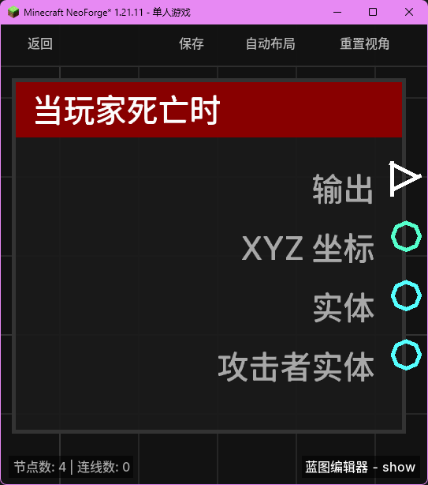

# 当玩家死亡时 (on_player_death)

当玩家在游戏中死亡时触发。

## 节点概览
- **分类**: 事件 > 玩家事件
- **内部ID**：`mgmc:on_player_death`
- 

## 端口定义

### 执行流 (Exec)
| 端口名称 | 类型 | 说明 |
| :--- | :--- | :--- |
| **执行输出** (exec_out) | 执行流 (Exec) | 玩家死亡时激活后续逻辑。 |

### 输出 (Outputs)
| 端口名称 | 类型 | 说明 |
| :--- | :--- | :--- |
| **XYZ** (xyz) | XYZ (XYZ) | 玩家死亡时的位置坐标。 |
| **实体** (entity) | 实体 (Entity) | 死亡的玩家实体。 |
| **攻击者实体** (attacker_entity) | 实体 (Entity) | 导致玩家死亡的直接攻击者实体（例如击杀玩家的生物或其他玩家）。如果死亡是由非生物原因（如摔落、溺水）造成的，则输出为 `null`。 |

## 行为说明
1. **触发时机**：在玩家生命值归零并进入死亡状态时触发。常用于记录死亡位置、统计击杀信息或触发死亡惩罚逻辑。
2. **攻击者识别**：通过“攻击者实体”端口可以获取击杀者的详细信息。如果死亡是由伤害来源（Damage Source）中的实体引起的，该端口将输出该实体；否则输出为空。
3. **坐标捕获**：输出的 XYZ 坐标记录了玩家死亡瞬间在世界中的精确位置。
