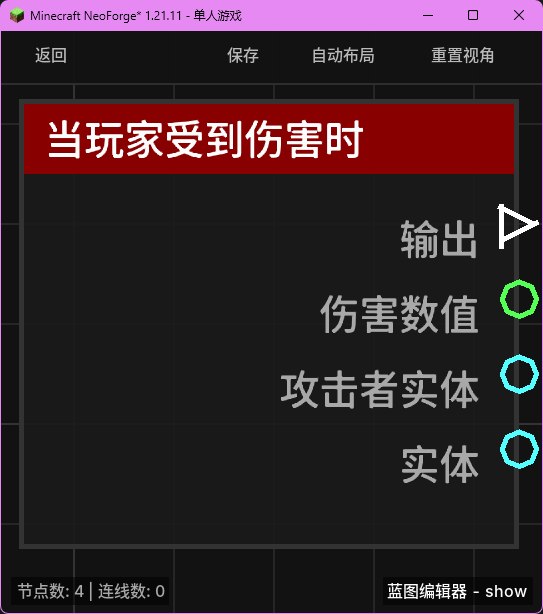

# 当玩家受到伤害时 (on_player_hurt)

当玩家受到任何形式的伤害（如攻击、摔落、窒息等）时触发。

## 节点概览
- **分类**: 事件 > 玩家事件
- **内部ID**：`mgmc:on_player_hurt`
- 

## 端口定义

### 输入 (Inputs)
该节点没有输入端口。

### 输出 (Outputs)
| 端口名称 | 类型 | 说明 |
| :--- | :--- | :--- |
| **执行** (exec) | 执行流 (Exec) | 当玩家受到伤害时执行后续节点。 |
| **伤害数值** (damage_amount) | 浮点数 (Float) | 玩家本次受到的原始伤害数值。 |
| **攻击者实体** (attacker_entity) | 实体 (Entity) | 造成伤害的实体（如果是生物攻击）。如果是环境伤害，则可能为空。 |
| **实体** (entity) | 实体 (Entity) | 受到伤害的玩家实体。 |

## 行为说明
1. **触发时机**：当玩家即将进入受伤状态（LivingIncomingDamageEvent）时触发。注意这是在伤害实际结算前触发的。
2. **伤害来源**：**攻击者实体 (attacker_entity)** 仅在伤害由另一个实体（如僵尸、其他玩家或发射的箭）造成时有效。对于摔落、溺水、仙人掌等环境伤害，该端口将输出 `null`。
3. **空值处理**：
    - 如果伤害来源不是实体，**攻击者实体 (attacker_entity)** 将为 `null`。
    - 在后续节点中使用 **攻击者实体** 前，建议先进行非空检查（如使用“分支”节点判断）。
4. **类型转换**：
    - **伤害数值 (damage_amount)** 可以自动转换为字符串进行打印。
    - **实体** 端口支持自动转换为其 UUID 或名称字符串。
