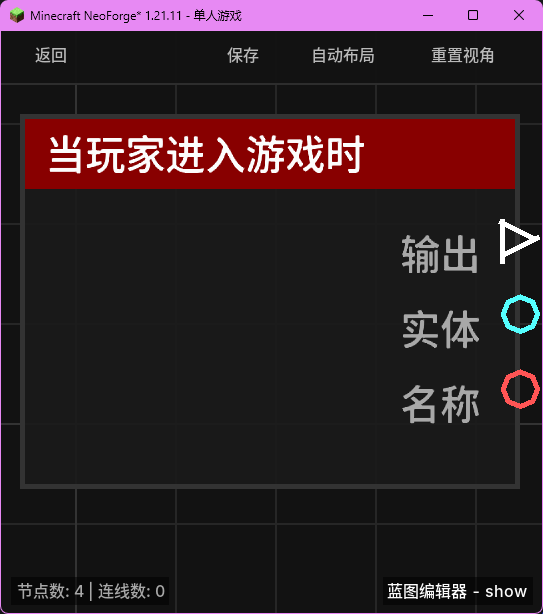

# 当玩家进入游戏时 (on_player_join)

当玩家成功连接并进入服务器（登录完成）时触发。

## 节点概览
- **分类**: 事件 > 玩家事件
- **内部ID**：`mgmc:on_player_join`
- 

## 端口定义

### 执行流 (Exec)
| 端口名称 | 类型 | 说明 |
| :--- | :--- | :--- |
| **执行输出** (exec_out) | 执行流 (Exec) | 玩家进入游戏时激活后续逻辑。 |

### 输出 (Outputs)
| 端口名称 | 类型 | 说明 |
| :--- | :--- | :--- |
| **实体** (entity) | 实体 (Entity) | 刚进入游戏的玩家实体。 |
| **名称** (name) | 字符串 (String) | 玩家的显示名称。 |

## 行为说明
1. **触发时机**：该事件在玩家完成加载并正式出现在世界中时触发。常用于实现欢迎消息、发放初始物品或初始化玩家数据等逻辑。
2. **作用范围**：该节点属于全局性质的玩家事件。无论蓝图绑定在何处，只要有玩家加入，所有包含此节点的蓝图都会被触发（除非有其他过滤逻辑）。
3. **数据提取**：通过该节点可以直接获取进入游戏的玩家实体引用，方便后续对该玩家进行操作。
