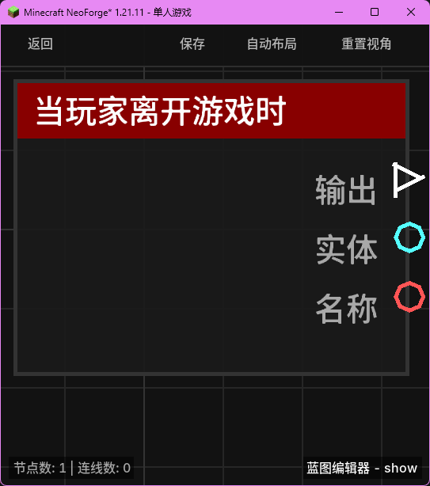

# 当玩家离开游戏时 (on_player_leave)

当玩家从当前服务器或单人世界中登出/离开时触发。

## 节点概览
- **分类**: 事件 > 玩家事件
- **内部ID**：`mgmc:on_player_leave`
- 

## 端口定义

### 输入 (Inputs)
该节点没有输入端口。

### 输出 (Outputs)
| 端口名称 | 类型 | 说明 |
| :--- | :--- | :--- |
| **执行** (exec) | 执行流 (Exec) | 当玩家离开游戏时执行后续节点。 |
| **实体** (entity) | 实体 (Entity) | 离开游戏的玩家实体。 |
| **名称** (name) | 字符串 (String) | 离开游戏的玩家名称。 |

## 行为说明
1. **主要行为**：当玩家点击“保存并回到主菜单”或因网络断开、被踢出等原因离开游戏时，该节点将被触发。
2. **触发时机**：该事件在玩家实体正式从世界中移除之前触发，因此仍然可以获取该玩家在离开瞬间的位置或状态数据。
3. **数据清理**：内部逻辑会自动清理该玩家相关的临时缓存数据（如位置记录）。
4. **空值处理**：作为事件触发节点，输出端口在事件发生时始终有效。
5. **类型转换**：
    - **实体 (entity)** 端口支持自动转换为其 UUID 字符串或名称字符串。
    - **名称 (name)** 为纯文本字符串。
