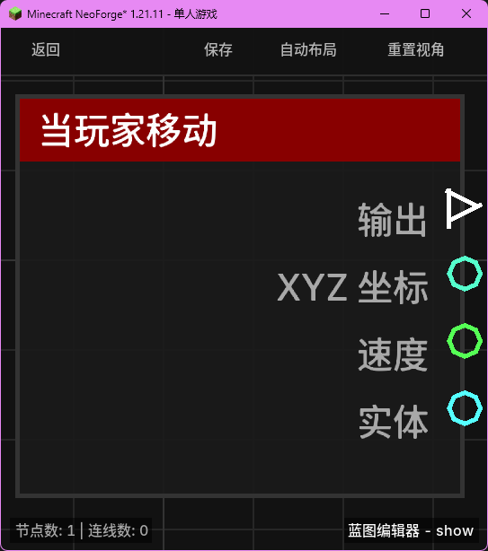

# 当玩家移动 (on_player_move)

当玩家在世界中发生位置移动时触发。

## 节点概览
- **分类**: 事件 > 玩家事件
- **内部ID**：`mgmc:on_player_move`
- 

## 端口定义

### 输入 (Inputs)
该节点没有输入端口。

### 输出 (Outputs)
| 端口名称 | 类型 | 说明 |
| :--- | :--- | :--- |
| **执行** (exec) | 执行流 (Exec) | 当玩家移动时执行后续节点。 |
| **XYZ 坐标** (xyz) | XYZ (XYZ) | 玩家当前的位置坐标。 |
| **速度** (speed) | 浮点数 (Float) | 玩家当前的移动速度（每刻移动的距离）。 |
| **实体** (entity) | 实体 (Entity) | 正在移动的玩家实体。 |

## 行为说明
1. **主要行为**：该节点会监听玩家的每一刻（Tick）状态。如果玩家在这一刻的位置与上一刻的位置相比发生了位移（位移平方大于 1E-6），则会触发该事件。
2. **触发频率**：由于是在每一刻检测，玩家持续移动时该节点会以最高每秒 20 次的速度高频触发。请注意不要在该节点后连接过于复杂的逻辑，以免影响性能。
3. **速度计算**：**速度 (speed)** 输出的是玩家在该刻的瞬时移动距离。
4. **空值处理**：作为事件触发节点，输出端口在事件发生时始终有效。
5. **类型转换**：
    - **XYZ 坐标 (xyz)** 可以自动转换为字符串或分解为 X、Y、Z 分量。
    - **实体 (entity)** 端口支持自动转换为其 UUID 字符串或名称字符串。
