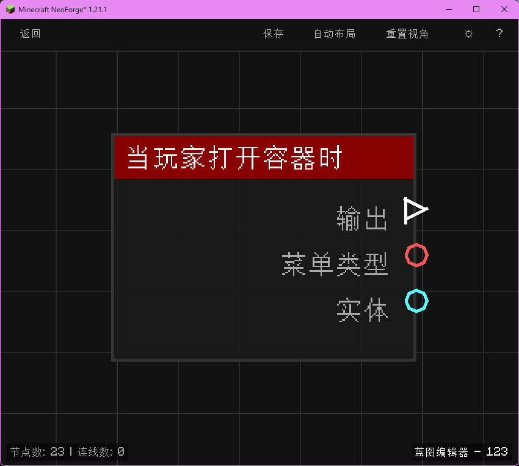

# 当玩家打开容器时 (on_player_open_menu)

当玩家打开菜单/容器界面时触发，输出菜单类型与玩家实体。

## 节点概览
- **分类**: 事件 > 玩家事件
- **内部ID**：`mgmc:on_player_open_menu`
- 

## 端口定义

### 输入 (Inputs)
该节点没有输入端口。

### 输出 (Outputs)
| 端口名称 | 类型 | 说明 |
| :--- | :--- | :--- |
| **执行** (exec) | 执行流 (Exec) | 当玩家打开容器时执行后续节点。 |
| **菜单类型** (menu_type) | 字符串 (String) | 被打开的菜单/容器类型 ID（例如 `minecraft:generic_9x3`、`minecraft:crafting`）。 |
| **实体** (entity) | 实体 (Entity) | 打开该菜单的玩家实体。 |

## 行为说明
1. **主要行为**：当玩家在游戏中打开任意菜单或容器界面（背包、工作台、熔炉、箱子、潜影盒等）时触发。
2. **触发时机**：该节点对应 NeoForge 的 `PlayerContainerEvent.Open`，在玩家实际打开容器界面后触发。
3. **菜单类型格式**：**菜单类型 (menu_type)** 输出为菜单类型的注册名，例如 `minecraft:generic_9x3`（单箱）、`minecraft:crafting`（工作台）、`minecraft:furnace`（熔炉）等。
4. **路由标识**：使用 `BlueprintRouter.PLAYERS_ID` 路由，每个玩家的蓝图实例独立运行。
5. **空值处理**：作为事件触发节点，输出端口在事件发生时始终有效。**菜单类型 (menu_type)** 始终为非空字符串。
6. **类型转换**：**实体 (entity)** 端口支持自动转换为其 UUID 字符串或名称字符串。