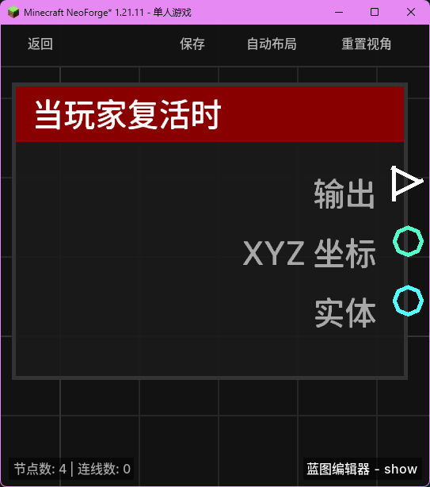

# 当玩家复活时 (on_player_respawn)

当玩家在服务器中复活时触发。

## 节点概览
- **分类**: 事件 > 玩家事件
- **内部ID**：`mgmc:on_player_respawn`
- 

## 端口定义

### 输入 (Inputs)
该节点没有输入端口。

### 输出 (Outputs)
| 端口名称 | 类型 | 说明 |
| :--- | :--- | :--- |
| **执行** (exec) | 执行流 (Exec) | 当事件触发时执行后续节点。 |
| **XYZ** (xyz) | XYZ (XYZ) | 玩家复活后的具体位置坐标。 |
| **实体** (entity) | 实体 (Entity) | 正在复活的玩家实体对象。 |

## 行为说明
1. **主要行为**：当玩家死亡并点击“复活”按钮，或者因其他机制（如指令、模组功能）重新生成在世界中时，该节点将被触发。
2. **坐标信息**：**XYZ (xyz)** 端口将输出玩家复活瞬间所在的精确坐标，通常为床的位置、世界出生点或锚点位置。
3. **空值处理**：作为事件触发节点，输出端口在事件发生时始终有效。若复活逻辑异常导致玩家实体不存在（极端情况），**实体 (entity)** 端口可能输出为 `null`。
4. **类型转换**：输出的 **实体 (entity)** 端口支持自动转换为其 UUID 字符串或名称字符串。
